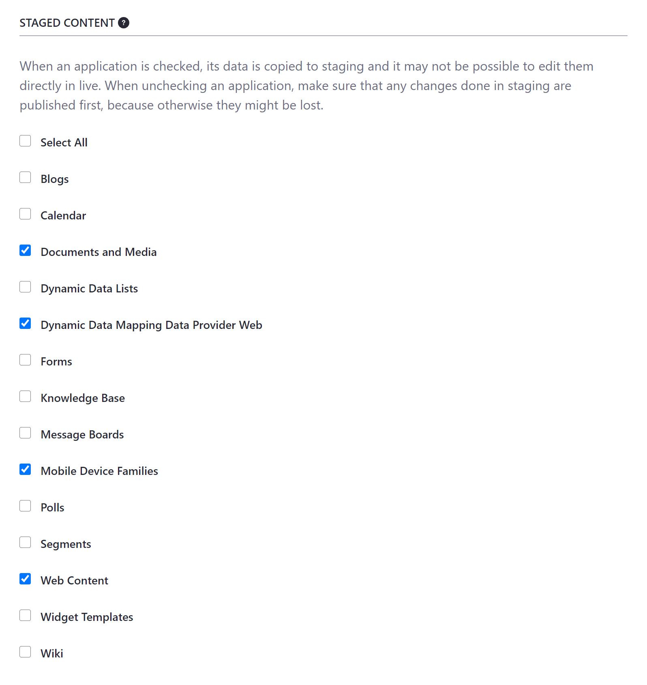

# Managing Data and Content Types in Staging

Liferay DXP's Staging tool provides ways to manage which application data and content types are available both during initial configuration and during the publication process. Because there can be so many relationships between applications and types of content, be sure to consider how they reference each other in your database before deciding to stage or unstage any categories.

* [Staging Data and Content Types](#staging-data-and-content-types)
* [Publishing Data and Content Types](#publishing-data-and-content-types)

## Staging Data and Content Types

As part of Staging configuration, you can select which application data and content types are staged. If staged, the selected data and content is managed by your Staging environment, along with all contained entities, and it may not be possible to edit them directly in Live.



It's recommended Users stage applications with data that originates on the development end. While staging data for collaborative applications, such as *blogs*, *message boards*, and *wikis*, is not recommended. This is because their data typically originates in the Live environment. If their content is staged, you will have to publish your Site manually whenever an end user posts for it to appear on Live.

Content must have specific attributes to be used in Staging. For instance, all staged content and entities should be Site-scoped, so they are always part of a Site. Otherwise, they are not eligible for staging. Page-scoped entities are only eligible for staging on published Pages. When scoped data is on a Page (e.g., Web Content Display widget) and the Page is published, the scoped data is published with it.

Any application data not staged is only contained in the Site's Live environment, while staged data exists in both environments. Staged application data is automatically published whenever a Page containing the application is published. And disabled applications that are checked are always automatically exported, while disabled and unchecked applications are never automatically published. Note that Asset Publisher and its data are always staged.

Disabled staged content types can also cause unintended problems if you're referring to them in the Staging environment. For example, if the Asset Publisher is set to display content types that are not staged, it won't be able to access them. Make sure to plan for the content types you'll need in your staged Site.

```important::
   After configuration, users are unable to change whether or not an application data or content type is staged. This is because staging and unstaging this data and content could cause inconsistencies between Staging and Live environments. To change these settings, you must turn staging off and re-enable it with your new configuration.
```

## Publishing Data and Content Types

During the publication process, you can also configure which application data and content types are published from Staging to Live. From the *Advanced* tab of the *Publish to Live* menu, you can view each type with any related data and content it may have.


Here, you can exclude some data and content types during publication or export to speed up the process. The following sections provide a number of tips to improve your publishing experience.

### Version History

Web content tends to be updated frequently, which can result in a high number of versions and lengthy publication times. To minimize the time it takes to publish these articles, you can choose to not publish the *Version History*. If you disable this, only the last approved version of each web content article is published to Live. This can significantly speed up the publication process.

By default, Version History is checked for publication, so you must manually disable this setting to only publish the latest approved version of your web content. To do this, go to *Control Panel* &rarr; *Configuration* &rarr; *System Settings* &rarr; *Web Content* &rarr; *Virtual Instance Scope* &rarr; *Web Content*, and toggle the *Version History by Default Enabled* checkbox.

### Previews and Thumbnails

Previews and thumbnails are generated automatically for documents. However, if your Site contains a large number of images or documents, it may be best to disable this feature in order to increase your publishing speed and limit the amount of disk space used.

It depends on your environment whether you'll want to publish file previews and thumbnails. Publishing them is a heavy operation, and you must also transfer the LAR file over the network if you use remote staging. If you decide to generate them on the Live Site, understand that this could take some time, since it's a CPU intense operation.

### Vocabularies

When working within a Site, you can select vocabularies from both the current Site as well as the global Site. While this doesn't pose an issue when creating content, it can cause issues when publishing.

For environments that use both global and local vocabularies, note that global vocabularies must be published to the Live Site through global Site Staging. One way to avoid confusion with vocabularies is to keep all vocabularies local or global. If both must be used, you can resolve the issue by ensuring that dependencies (e.g., categories and vocabularies) are published before publishing the Site that depends on them, whether the dependencies are local or global.

```note::
   Assets like tags, categories, structures, templates, widget templates, document types, and dynamic data lists can also be shared by a parent to its child Sites. In this case, ensure that the parent's dependencies are published before the Site in question.
```

### Deletions

The Staging framework gathers deletions (including trashed entities) in a Site. These deletions can be published to clean up the Live Site. If you plan to process it later, or if it's not a problem to have lingering data on Live, this can be turned off as well to save execution time during the process.

## Additional Information

* [Staging Overview](./staging-overview.md)
* [Understanding the Publication Process](./understanding-the-publication-process.md)
* [Staging UI Reference](./staging-ui-reference)
