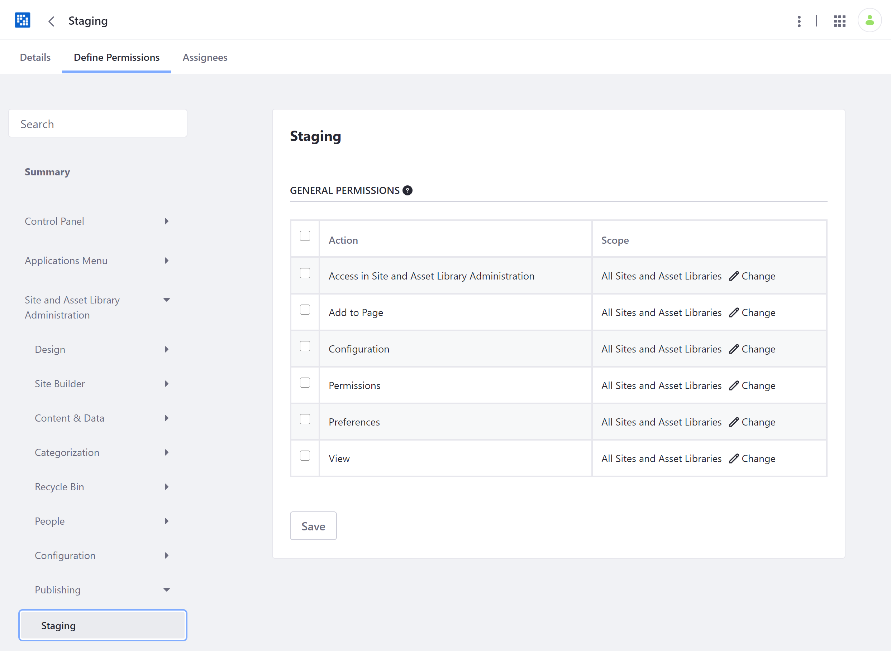

# Managing Staging Permissions

With Staging, you can manage User permissions that deal directly with Staging and Page versioning.

-   [General Staging Permissions](#general-staging-permissions)
-   [Related Site Permissions](#related-site-permissions)
-   [Individual Variation Permissions](#individual-variation-permissions)

## General Staging Permissions

1. Go to _Control Panel_ &rarr; _Users_ &rarr; _Roles_.

1. Click on the _Actions_ button (  ) for the Role you want to modify and select _Edit_.

    Alternatively, you can create a new Role by clicking on the _Add_ button () and completing the _New Role_ section.

1. Click on the _Define Permissions_ tab.

1. In the side menu, click on _Site and Asset Library Administration_ &rarr; _Publishing_ &rarr; _Staging_.

1. Select which General Staging permissions you want to assign to the User Role and define their scope.

    

## Related Site Resource Permissions

From the _Define Permissions_ tab, you can also assign other related Site _Resource permissions_ relevant for Staging. In the side menu, click on _Control Panel_ &rarr; _Sites_ &rarr; _Sites_.

The following permissions are relevant to Staging:

**Add Page Variation**: This permission hides/shows the _Add Page Variation_ button on the Staging Bar's Manage Page Variations screen.

**Add Site Pages Variation**: This permission hides/shows the _Add Site Pages Variation_ button on the Staging Bar's Manage Site Page Variations screen.

**Export/Import Application Info**: If the Publish Staging permission is not granted, this permission hides/shows the application level Export/Import menu. The Configuration permission for the Export/Import app is also required.

**Export/Import Pages**: If the Publish Staging permission is not granted, this permission hides/shows the Export/Import app in the Site Administration menu.

**Manage Staging**: This permission hides/shows the Staging Configuration menu in the _Site Administration_ &rarr; _Publishing_ &rarr; _Staging_ &rarr; _Actions_ menu.

**Publish Application Info**: This permission hides/shows the application level Staging menu.

**Publish Staging**: This permission hides/shows the _Publish to Live_ button on the Staging Bar and hides/shows the _Add Staging Process_ button in the Site Administration menu's Staging app. This permission automatically applies the Export/Import Application Info, Export/Import Pages, and Publish Application Info permission functionality regardless of whether they're unselected.

**View Staging**: If _Publish Staging_, _Manage Pages_, _Manage Staging_, or _Update permissions_ are not granted, this permission hides/shows the Site Administration menu's Staging app.

## Individual Variation Permissions

You can also set permissions for individual variations so certain Users have access to manage some, but not all variations.

1. Click on the _Actions_ button (  ) in the Staging bar and select either _Site Pages Variation_ or _Page Variations_.

    

1. Click on the _Actions_ button (  ) for the variation you want to configure and select _Permissions_.

    

1. Use the check boxes to configure User permissions for the selected variation, and then click _Save_.

    

## Additional Information

-   [Staging Overview](./staging-overview.md)
-   [Page Versioning](./page-versioning.md)
-   [Staging UI Reference](./staging-ui-reference.md)
