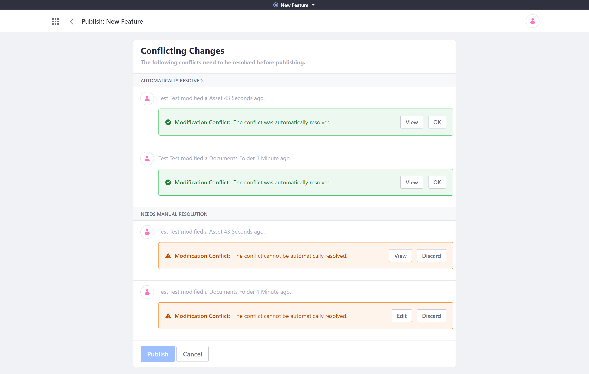

# Resolving Conflicts

The Publications tool is highly transparent so you can identify and resolve conflicts when publishing. By default, Publications can automatically resolve some conflicts, while others require User intervention. Users can encounter three general types of conflicts: *Modification*, *Constraint*, and *Missing Parent*.

## Automatic and Manual Resolutions

Publications provides convenient automatic and manual options to quickly resolve publishing conflicts. Alternatively, you can always cancel publishing, return to editing your publication or production, and implement a different solution.



### Automatic Resolutions

In Publications, automatic resolutions are pre-configured responses to certain kinds of publishing conflicts. These responses provide pre-set solutions, so you can publish your changes without further action. These solutions may include adding, modifying, or removing content from the current publication, or replacing the version of content in production with your publication's version.

When an automatic solution is available, you'll be notified during publishing. You can then click on *View* to review the solution's details. To implement the automatic solution, click on *Publish*.

Both modification and constraint conflicts can be resolved automatically, depending on your configuration. See [Integrating Services with Change Tracking](./integrating-services-with-change-tracking.md) for more information.

### Manual Resolutions

By contrast, manual resolutions require User intervention before being able to publish a publication. When a manual resolution is necessary, you'll be notified and prompted to *Edit* or *Discard* changes.

* **Edit**: When you click on *Edit*, you're redirected to the cause of the conflict in the current publication. From there, you can make the changes necessary to resolve the conflict.

* **Discard**: When you click on *Discard*, you're redirected to the *Discard Changes* page. This lists all changes that will be discarded. You can click on *Discard* to permanently remove them from your publication.

   ```warning::
      Discarding is permanent and cannot be reversed. Ensure you've saved any changes you want to keep before using discarding them from your publication.
   ```

## Resolving Modification Conflicts

Modification conflicts occur when the same entity has been modified in both production and your publication. Examples include conflicting versions of web content articles or other assets. To resolve modification conflicts, you can edit the conflicting material, discard the conflicting changes in your publication, or replace the version in production.

## Resolving Constraint Conflicts

Constraint conflicts occur when an entity in your publication cannot coexist with an entity in production. Examples include when there are duplicate folders or assets between your publication and production. To resolve constraint conflicts, you can discard conflicting changes in your publication or edit the version in production.

## Resolving Missing Parent Conflicts

Missing Parent conflicts occur when a child entity is created or edited in your publication, while its parent has been removed from production. Examples include deleting a folder from production, while your publication adds or modifies a sub-folder. To resolve missing parent conflicts, you can discard the conflicting changes from your publication or revert the deletion in production. See [Reverting Changes](./reverting-changes.md) for how to revert changes published to production.

## Additional Information

* [Creating and Managing Publications](./creating-and-managing-publications.md)
* [Making and Publishing Changes](./making-and-publishing-changes.md)
* [Resolving Conflicts](./resolving-conflicts.md)
