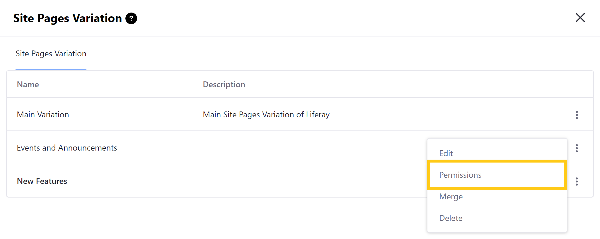
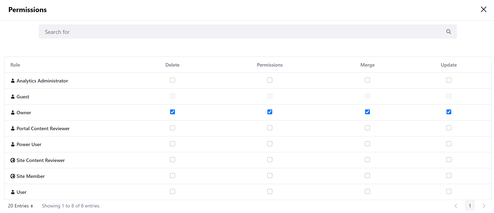

# Managing Staging Permissions

With Staging, you can manage User permissions that deal directly with Staging and Page versioning.

* [General Staging Permissions](#general-staging-permissions)
* [Related Site Permissions](#related-site-permissions)
* [Individual Variation Permissions](#individual-variation-permissions)

## General Staging Permissions

1. Go to *Control Panel* &rarr; *Users* &rarr; *Roles*.

1. Click on the *Actions* button (  ) for the Role you want to modify and select *Edit*.

   Alternatively, you can create a new Role by clicking on the *Add* button () and completing the *New Role* section.

1. Click on the *Define Permissions* tab.

1. In the side menu, click on *Site and Asset Library Administration* &rarr; *Publishing* &rarr; *Staging*.

1. Select which General Staging permissions you want to assign to the User Role and define their scope.

   

## Related Site Resource Permissions

From the *Define Permissions* tab, you can also assign other related Site *Resource permissions* relevant for Staging. In the side menu, click on *Control Panel* &rarr; *Sites* &rarr; *Sites*.

The following permissions are relevant to Staging:

**Add Page Variation**: This permission hides/shows the *Add Page Variation* button on the Staging Bar's Manage Page Variations screen.

**Add Site Pages Variation**: This permission hides/shows the *Add Site Pages Variation* button on the Staging Bar's Manage Site Page Variations screen.

**Export/Import Application Info**: If the Publish Staging permission is not granted, this permission hides/shows the application level Export/Import menu. The Configuration permission for the Export/Import app is also required.

**Export/Import Pages**: If the Publish Staging permission is not granted, this permission hides/shows the Export/Import app in the Site Administration menu.

**Manage Staging**: This permission hides/shows the Staging Configuration menu in the *Site Administration* &rarr; *Publishing* &rarr; *Staging* &rarr; *Actions* menu.

**Publish Application Info**: This permission hides/shows the application level Staging menu.

**Publish Staging**: This permission hides/shows the *Publish to Live* button on the Staging Bar and hides/shows the *Add Staging Process* button in the Site Administration menu's Staging app. This permission automatically applies the Export/Import Application Info, Export/Import Pages, and Publish Application Info permission functionality regardless of whether they're unselected.

**View Staging**: If *Publish Staging*, *Manage Pages*, *Manage Staging*, or *Update permissions* are not granted, this permission hides/shows the Site Administration menu's Staging app.

## Individual Variation Permissions

You can also set permissions for individual variations so certain Users have access to manage some, but not all variations.

1. Click on the *Actions* button (  ) in the Staging bar and select either *Site Pages Variation* or *Page Variations*.

   

1. Click on the *Actions* button (  ) for the variation you want to configure and select *Permissions*.

   

1. Use the check boxes to configure User permissions for the selected variation, and then click *Save*.

   

## Additional Information

* [Staging Overview](./staging-overview.md)
* [Page Versioning](./page-versioning.md)
* [Staging UI Reference](./staging-ui-reference.md)
