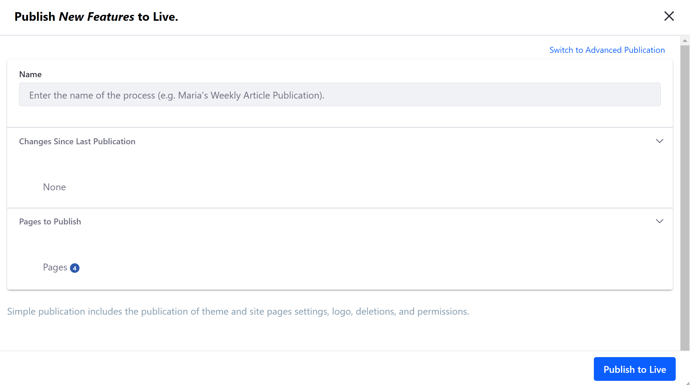
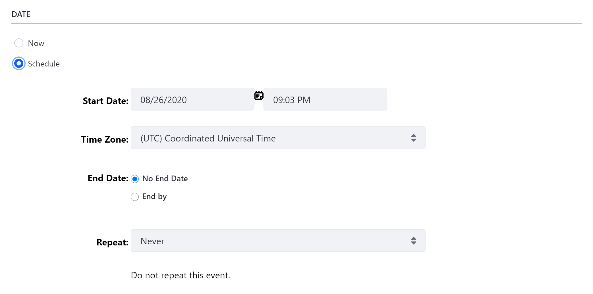
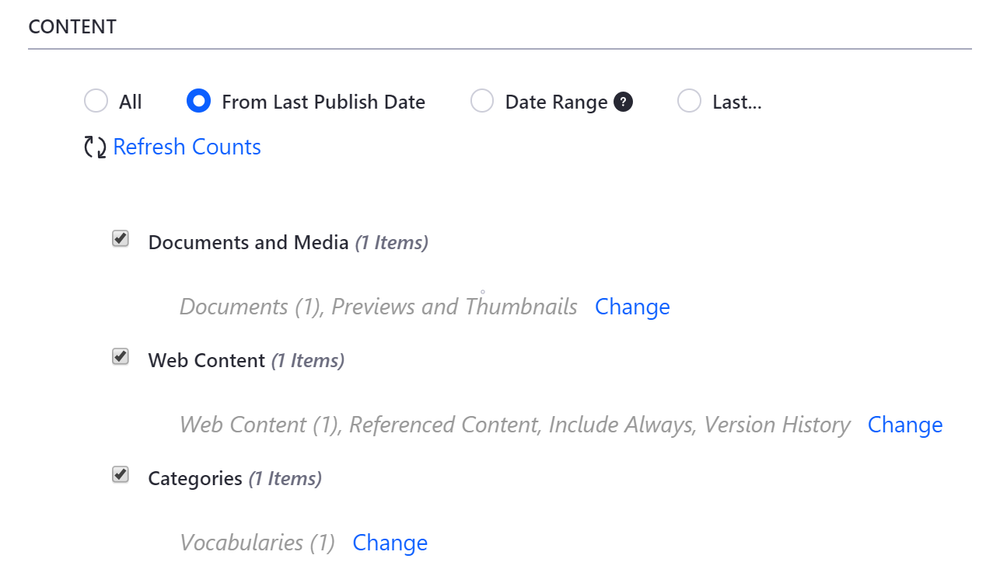
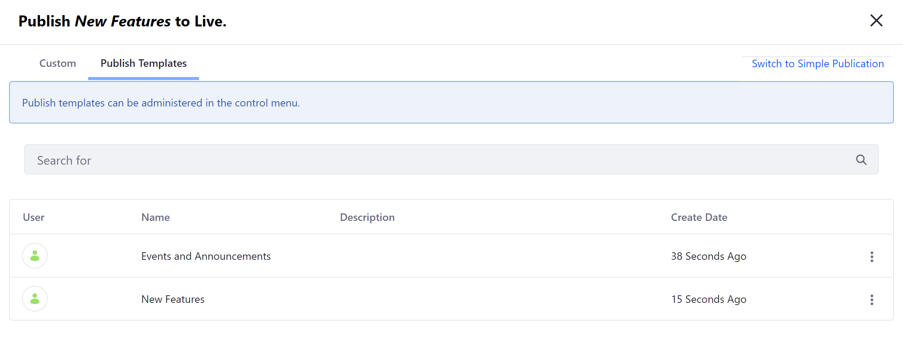
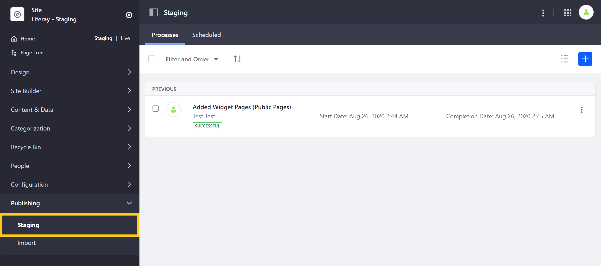
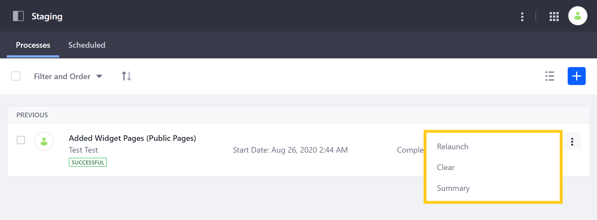

# Staging UI Reference

After enabling Local or Remote Live Staging for your Site, most Page configuration options are only accessible in your Staging environment. This prevents Users from directly editing Live Pages.

Also, once staging is enabled, you can access additional options in your Staging environment. These options are in the _Staging bar_, _Publish to Live_ menu, and _Staging Page_.

-   [Staging Bar](#staging-bar)
-   [Publish to Live](#publish-to-live)
-   [Staging Page](#staging-page)

## Staging Bar

When Staging is enabled for a Site, you can access additional options via the Staging bar on each of your Site's Pages. In this bar you can toggle between Staging and Live environments, as well as click on _Publish to Live_ for your staged Pages.


You can also access the following options for Widget Pages in your Staging environment via the Staging bar:

-   **Site Pages Variation**: You can toggle between variations of Page sets in your staged Site using the drop-down menu. You can also manage and create Page set variations by clicking on the _Actions_ button (  ) in the Staging bar and selecting _Site Pages Variation_. See [Page Versioning](./page-versioning.md) for more information.

-   **Page Variations**: You can toggle between variations of a single Page in your staged Site using the drop-down menu. You can also manage and create Page variations by clicking on the _Actions_ button (  ) in the Staging bar and selecting _Page Variations_. See [Page Versioning](./page-versioning.md) for more information.

-   **Undo/Redo**: You can undo or redo recent changes to a Page by clicking on the _Actions_ button () in the Staging bar and selecting _Undo_/_Redo_. Once you've marked a Page as _Ready for Publication_, you can't undo or redo recent changes.

-   **History**: You can view and manage the Page revision history by clicking on the _Actions_ button () in the Staging bar and selecting _History_. From here, you can also revert a Page to an earlier version by clicking on the _Actions_ button () for the Page version you want to restore and selecting _Mark as Ready for Publication_.

-   **Ready for Publication**: When you have finished making your changes, click on _Ready for Publication_ to change the Page's status from _Draft_ to _Ready for Publication_. You can then click _Publish to Live_ to configure and initiate the publication process for your changes. When you publish a Page to Live, only the version marked as _Ready for Publication_ is published.

## Publish to Live

When you click on _Publish to Live_, a modal window appears with additional options for configuring your publication. You can publish using _Simple_ or _Advanced_ settings.


## Simple Publication

**Name**: Enter a descriptive name for your publication into the _Name_ field.

**Changes Since Last Publication**: View staged changes made since your last publication.

**Pages to Publish**: View the number of Pages included in your publication.

```note::
   This displays the number of Page deletions tracked by the Staging framework. Keep in mind that this number counts the Page deletions on the Staging Site, not how many Pages will be deleted on the on the Live Site. There could be an inconsistency between the number of Page deletions to be published and the actual number of Pages present on either of the Staging and Live Sites.
```

When ready, click on _Publish to Live_ to initiate publishing.



## Advanced Publication

With Advanced Publication, you can choose to define custom publication settings or use a saved publishing template. To access advanced publication settings, click on _Switch to Advanced Publication_ in the modal window.

Here, you can access information and settings that you can use to customize your publication. In the _Custom_ tab, you can specify content, dates, Pages, and more for your publication. You can switch to the _Publish Template_ tab and use a pre-configured template for your publication.


Custom advanced publication settings are divided into the following sections:

**Name**: Enter a descriptive name for your publication into the _Name_ field.

**Date**: Select whether to publish your changes immediately, or _schedule_ your changes to be published at a later date and time. You can also determine whether and how frequently your publication is repeated.



**Deletions**: Select whether you want to _Delete Application Data Before Importing_, and whether you want to _Replicate Individual Deletions_.


**Pages**: Select which Page set variation and individual Pages you want to publish, as well as the look and feel of your selected Pages. You can also select whether to _Delete Missing Pages_, which deletes all Pages from the Live Site that are not present on the Staging Site. If you choose a Page to be published from the Pages menu, the widgets and their references are always published.


If you want to publish pages with a custom theme, you must check the Theme Settings option under the _Look and Feel_ heading for your staging configuration. Otherwise, the default theme is applied.

**Content**: Select the content you want to include in your publication. You can publish _all_ content of the selected types, or specify a date and time parameter to limit the content published. You can also click on _Change_ for each content type to manage items and other settings included in each type, such as _version history_, _vocabularies_, and _previews and thumbnails_. See [Managing Data and Content Types in Staging](./managing-data-and-content-types-in-staging.md) for more information.



**Permissions**: Select whether to include permissions for the Pages and widgets when your changes are published.


Instead of manually configuring advanced options every time you publish a Page or content, you can save your staging configuration as a [_publication template_](#publish-templates) for future use. To view and select a saved template for your publication, click on the _Publish Templates_ tab.



When ready, click on _Publish to Live_ to initiate publishing.

## Staging Page

Once you've enabled Staging, the options available from the _Publishing_ tab are modified. When in the Live environment, you can only access the _Export_ feature. When in the Staging environment, you can only access the _Import_ and _Staging_ features.

You can also access new options in the Staging Page. You can now view publication _processes_, create and manage _publish templates_, and modify or disable Staging for your Site.



### Previous and Future Publication Processes

When you publish with Staging, it's captured as a _process_ and stored for future reference. To view and manage these processes, go to _Product Menu_ &rarr; _Publishing_ &rarr; _Staging_.

In the _Processes_ tab is a list of staging processes that have been completed. From here, you can _relaunch_, _clear_ or view a _summary_ of any previous publications by clicking on a process's _Actions_ button (  ).



You can also click on the _Add_ () button to create a new publication process using a custom configuration or pre-defined publishing template.

In the _Scheduled_ tab, you can view all scheduled publication processes.

### Publish Templates

If you regularly create similar staging configurations, you can create your own _publish templates_ to save time. To create a template, click on the _Actions_ button (  ) in the _Application_ bar of the _Staging_ Page. Then, select _Publish Templates_.


From here, you can create and manage templates for frequent publishing configurations. You can then use a template by clicking on its _Actions_ button (  ) and selecting _Publish_.


You can also use a template when publishing a Page or content using the _Publish to Live_ button in the Staging bar. See [Advanced Publication](#advanced-publication) for more information.

### Staging Configuration

After setting up Staging, you can access the Staging Configuration Page by clicking on the _Actions_ button (  ) in the _Application_ bar of the _Staging_ Page. Then, select _Staging Configuration_.


From here, you can disable Staging for your Site, or modify your [Page versioning](page-versioning.md) settings. However, _Staged Content_ options cannot be modified after the initial setup.

## Additional Information

-   [Staging Overview](./staging-overview.md)
-   [Understanding the Publication Process](./understanding-the-publication-process.md)
-   [Page Versioning](./page-versioning.md)
-   [Managing Data and Content Types in Staging](./managing-data-and-content-types-in-staging.md)
