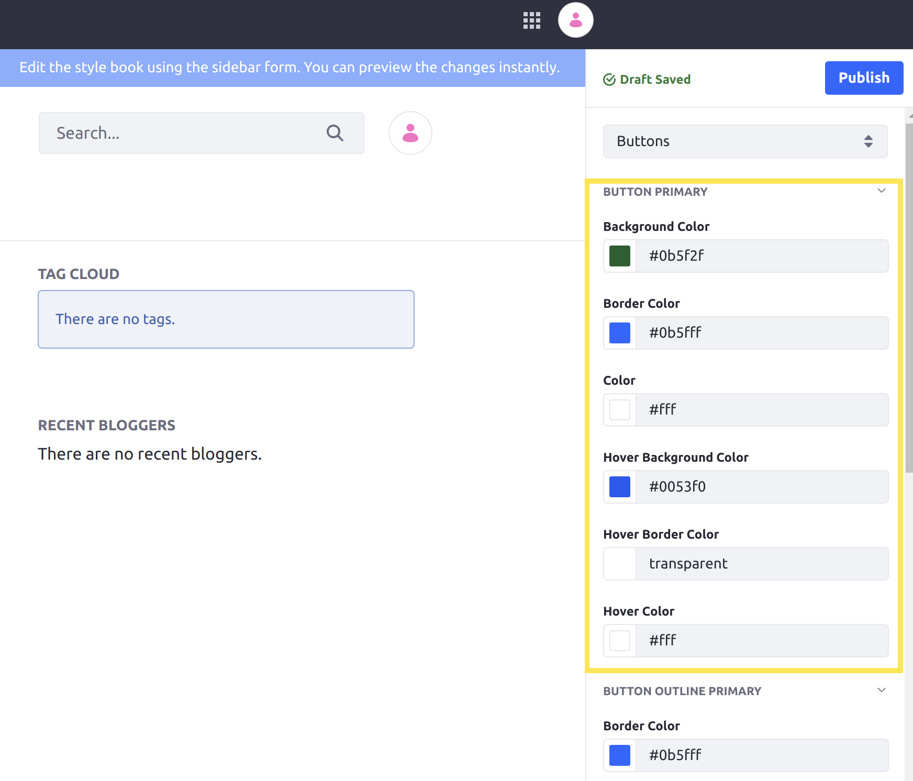

# Style Book Token Definitions

Style Books gives options that are grouped into various categories that are defined per theme. Each of the options provided in each category is defined with a *token*. The collection of all tokens defined for a theme is the *token definition*.

When you assign a theme to your Site's Public Pages, the token definition included with that theme is used when creating a Style Book for the Site.

## Defining Tokens for Your Style Book

Since the token definition is tied to your theme, each of the token definitions must correspond to a CSS variable contained within your theme module. Specify the token definitions themselves in a `.json` file within your theme module's folder, named `frontend-token-definition.json`. 

### Token Categories

The tokens that define the options for configuring your Style Book are grouped into categories. Each category appears as one of the options in the drop-down menu when you are editing your Style Book.


Define each of these categories within a `frontendTokenCategories` field within your `frontend-token-definition.json` file:

```json
{
    "frontendTokenCategories": [
        {
            "frontendTokenSets": [],
            "label": "buttons",
            "name": "buttons"
        }
    ]
}
```

Define a `label` and a `name` for each of your token categories. The `label` value is interpeted as a language key and displayed as the option in the drop-down menu for your category. <!-- Add link to article explaining localization when it is available. -->

### Token Sets

Each category is further organized into token sets. Token sets correspond to the collapsible groups of options that appear when you are editing a Style Book.

For example, using the default Classic theme, the *Button Primary* token set (within the *Buttons* category) includes all of the tokens for the options for standard button colors:



Define each token set within the `frontendTokenSets` field within each of your defined categories:

```json
{
    "frontendTokenCategories": [
        {
            "frontendTokenSets": [
                {
                    "frontendTokens": [],
                    "label": "primary-buttons",
                    "name": "primaryButtons"
                }
            ],
            "label": "buttons",
            "name": "buttons"
        }
    ]
}
```

Define a `label` and `name` for each token set just like with each category.

### Token Definitions

Finally, all of the tokens for each token set contain a set of properties within them to configure each of the options.

Define all of the tokens within each token set's `frontendTokens` field. Here is a list of all of the properties you can use for your tokens:

* **defaultValue**: The default value displayed for the option. This field must match up with the default value used in the CSS.

* **editorType**: Use this field if you want to use a color picker editor for the field. The only supported value is `"ColorPicker"`.

* **mappings**: The mapping between the token definition name to the corresponding CSS variable name (must contain `type` and `value` as nested fields). Use `"cssVariable"` as the `type`, and define the `value` as the CSS variable name.

* **label**: The language key that is shown for the option when editing a Style Book.

* **name**: The token's name.

* **type**: The type of data that the token will show. Use `"Integer"`, `"Float"`, or `"String"` to display a text field that can hold those types of values. Use `"Boolean"` to instead display a checkbox.

* **validValues**: Optional property that lists available options for the User in the UI. This field must contain a nested list of `label` and `value` pairs (`value` is the field's value in CSS). This property cannot be used together with `editorType`.

Here is an example list of tokens within a token set:

```
"frontendTokens": [
    {
        "defaultValue": "#0B5FFF",
        "editorType": "ColorPicker",
        "label": "primary",
        "mappings": [
            {
                "type": "cssVariable",
                "value": "primary"
            }
        ],
        "name": "primaryColor",
        "type": "String"
    },
    {
        "defaultValue": "sans-serif",
        "label": "font-family",
        "mappings": [
            {
                "type": "cssVariable",
                "value": "fontFamily"
            }
        ],
        "name": "fontFamily",
        "type": "String",
        "validValues": [
            {
                "label": "sans-serif",
                "value": "sans-serif"
            },
            {
                "label": "monospace",
                "value": "Courier New"
            }
        ]
    }
]
```

## Matching CSS Variables to Style Book Tokens

The `frontend-token-definition.json` file containing your token definition must be in the root level of your theme module folder. Every token defined in your token definition must represent a style (color, spacing, font, etc.) in the CSS of your theme.

All of the styles that your tokens represent must be coded as CSS variables. For example, take this definition of a token (giving an option to configure a font):

```json
{
    "defaultValue": "sans-serif",
    "label": "font-family-base",
    "mappings": [
        {
            "type": "cssVariable",
            "value": "font-family-base"
        }
    ],
    "name": "fontFamilyBase",
    "type": "String"
}
```

This token may represent a style in your CSS like this:

```css
:root {
    --font-family-base: 'sans-serif'
}

body {
    font-family: var(--font-family-base);
}
```

The value in the token definition's `mappings` (`font-family-base`) matches the variable name in the CSS. Use two hyphens to precede the CSS variable name (in this example, `--font-family-base`).

```important::
   If a value for ``defaultValue`` is included in your token definition, then this must match the default value defined in the matching CSS variable definition.
```

## Additional Information

* [Using a Style Book to Standardize Site Experience](../using-a-style-book-to-standardize-site-experience.md)
<!-- Add link to token definition tutorial when available -->