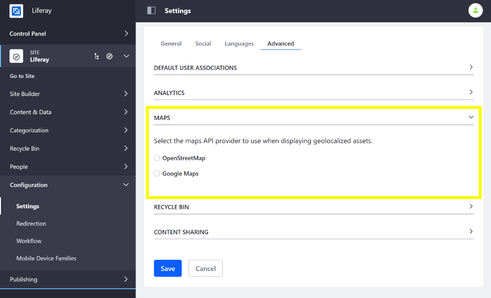

# Configuring Geolocation for Assets

<!-- This article could use an introductory paragraph that answers: what geolocated assets are - IDEALLY we present a screenshot of an asset being displayed in liferay that shows geolocation data included. This gives the reader a sense of what this article is helping them accomplish. -->

1. Open the Product Menu and go to _Configuration_ &rarr; _Settings_ (previously _Site Settings_).
1. Select the _Advanced_ tab and scroll down to the _Maps_ sub-heading and expand it.
1. Click the radio button for the maps API provider you want to use when displaying your geolocalized assets and optionally provide an API key if applicable.

    

    

1. Scroll down and click _Save_ to apply the changes.

[Geolocalized assets](../../../content-authoring-and-management/05-tags-and-categories/01-user-guide/01-geolocating-assets/README.md) can be displayed for documents, web content articles, DDL records, etc.
