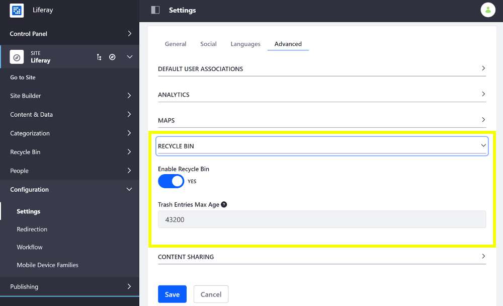

# Configuring the Asset Recycle Bin for Sites

The Recycle Bin stores content and assets that have been flagged for deletion, before they are permanently removed from the system. This functionality can be enabled globally by default and can be configured on a per-site basis. See the [Recycle Bin](../../../content-authoring-and-management/recycle-bin/user-guide/introduction-to-the-recycle-bin.md) section for more information on the Recycle Bin.

## Configuring the Recycle Bin for Sites

To enable or disable the Recycle Bin for a particular site, follow these steps:

1. Open the Product Menu and go to _Configuration_ &rarr; _Settings_ (previously _Site Settings_).
1. Select the _Advanced_ tab and scroll down to the _Recycle Bin_ sub-heading and expand it.
1. Toggle the _Enable Recycle Bin_ option from _YES_ to _NO_ to enable/disable the Recycle Bin for the Site.
1. Optionally provide a value (in minutes) in the _Trash Entries Max Age_ input to specify how long the recycled assets should remain in the Recycle Bin before they are permanently deleted.

    

1. Scroll down and click _Save_ to apply the changes.

Your configuration is saved.

```warning::
   When the Recycle Bin is disabled for a site, content and assets that are removed are permanently deleted.
```

## Additional Information

-   [Introduction to the Recycle Bin](../../../content-authoring-and-management/recycle-bin/user-guide/introduction-to-the-recycle-bin.md)
-   [Configuring the Recycle Bin](../../../content-authoring-and-management/recycle-bin/user-guide/configuring-the-recycle-bin.md)
