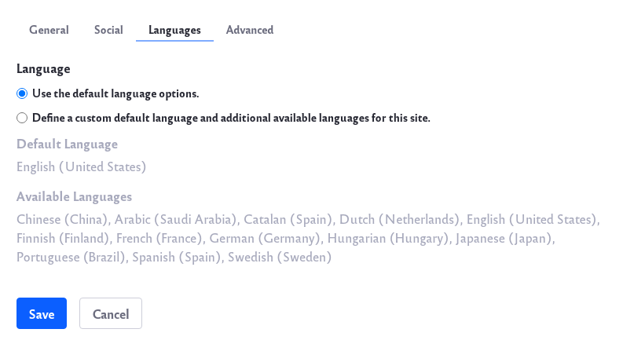
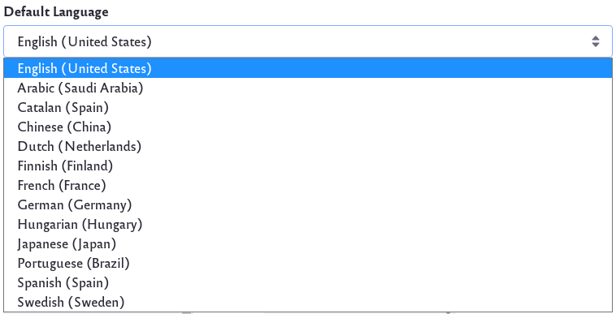
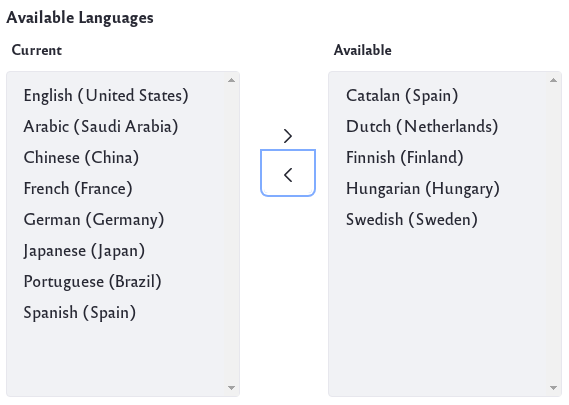

# Site Localization

## Configuring Site Languages
Liferay DXP allows you to set your installation's default language. You can also define a Site's enabled languages. Follow these steps to change your settings:

1. In the [Site Settings UI](../site-settings-ui-reference.md), click on the Languages tab.

    

1. Click on *Define a custom default language and additional available languages for this site*.

    

1. You can change the default language to any of the available languages in the drop-down list.

1. You can also choose which additional langauges are enabled or disabled.

    

1. Use the left and right arrows to enable or disable additional languages.

1. Click on the *Save* button to save any changes.

## Modifying Localizable Site Fields

Some Site setting fields have a language flag appended to the end. These fields can be translated into other languages.

To modify a localizable field,

1. Click the language flag beside the field.

    

1. Enter the new value in the selected language. The default value is displayed beneath the field for reference.

    

Liferay DXP automatically saves the translation for each language and displays the translated value when that specific language is selected for the instance. If a translation for the field is not provided, the default instance language's value for that field is displayed.
