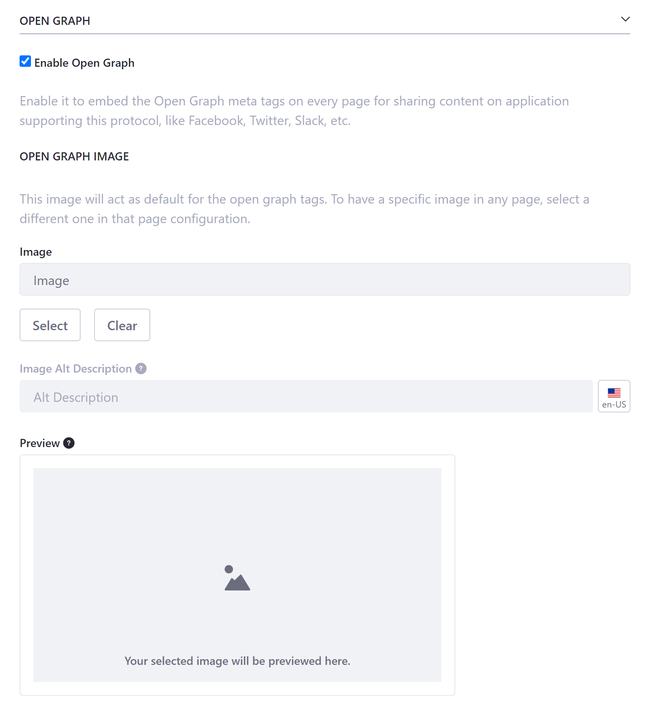
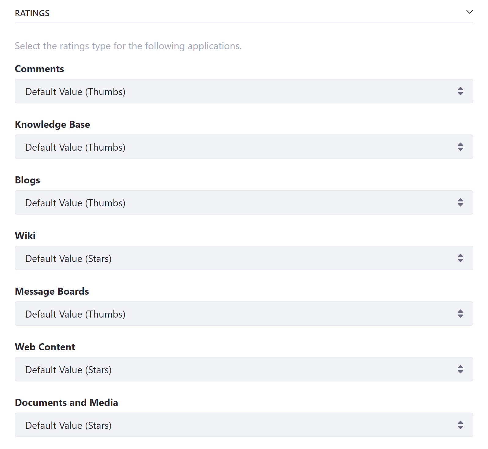
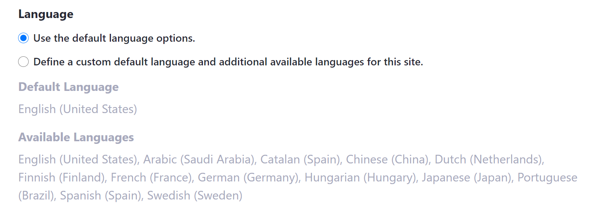
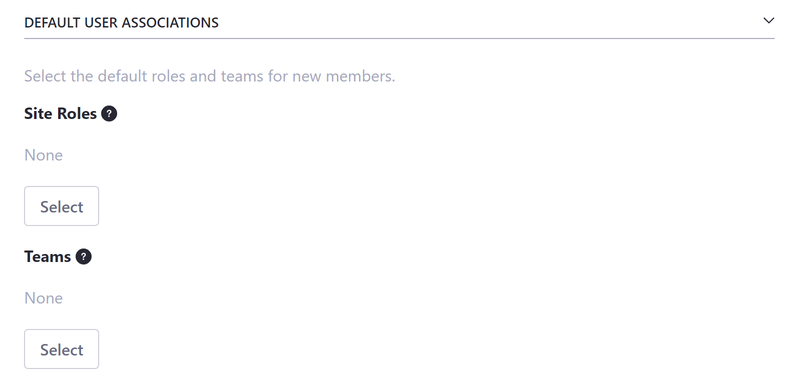
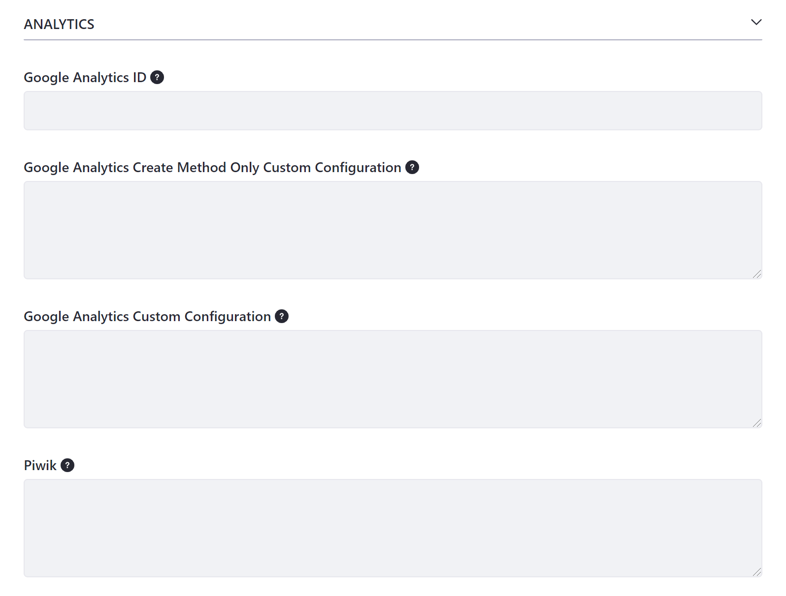

# Site Settings UI Reference

To view a Site's settings, open the Site Menu () and go to *Configuration* &rarr; *Settings*, where you'll see the following tabs:

* [General](#general)
* [Social](#social)
* [Language](#language)
* [Advanced](#advanced)


```note::
   Many of these settings can be localized to provide translations based on a user's locale. See `Introduction to Localization <https://help.liferay.com/hc/en-us/articles/360028746672-Introduction-to-Localization>`_ and `Modifying Localizable Site Fields <./configuring-site-languages/modifying-localizable-site-fields.md>`_ or more information.
```

## General

General settings range from core configuration, like a Site's Membership Type, to finer details like Documents and Media indexing options. The tab's content is organized into the following subsections: Details, Pages, Categorization, Site URL, Documents and Media, Open Graph, Asset Auto Tagging, Sharing, and Custom Fields.

### Details

**Site ID**: A unique number automatically generated for a Site at its creation. This ID is permanent and cannot be changed.

**Name**: Set a Site's title using the *Name* field. This title is displayed in the browser's title bar as well as the header for each Site page. You can also localize a Site's name via the *Language Flag* button.

**Description**: Use the *Description* field to explain a Site's purpose. You can also localize a Site's description via the *Language Flag* button.

**Active**: Determine whether a Site is *Active* or *Inactive*. While inactive, a site is inaccessible to users, though it can be reactivated if desired.

**Membership Type**: A *Membership Type* determines how restrictive a Site's membership is. See [Changing Site Membership Types](./site-users/changing-site-membership-type.md) for more information.

**Allow Manual Membership Management**: Determine whether to allow members to be manually added or removed from a Site. If your Site's membership is handled automatically by a membership policy, you can disable this setting. See [Managing Membership Policies for Sites](./site-users/changing-site-membership-type.md) for more information.

**Parent Site**: Designate a Site as a child Site by selecting its parent Site. See [Site Hierarchies](../building-sites/site-hierarchies.md) for more information.

**Limit Membership to Parent Site Members**: Determine whether a child Site's membership is limited to members of its parent Site. This option only appears for child Sites.

### Pages

View a Site's Public and Private Pages, if any exist, and enable or disable the propagation of changes from the selected Site template. If they don't exist, a Site Templates selector appears for creating pages with a template.


### Custom Fields

View and configure any custom fields you've defined for your pages. With these fields, you can set page metadata, such as author, date of creation, and geolocation. This section only appears once you've configured custom fields for your Site. See [Custom Fields](../../system-administration/configuring-liferay/adding-custom-fields.md) for more information.

### Categorization

Use Categories and Tags to categorize a Site's content so users can more easily find it. For more information on using tags and categories, see [Organizing Content with Tags and Categories](../../content-authoring-and-management/tags-and-categories/organizing-content-with-categories-and-tags.md).

### Site URL

**Friendly URL**: Set a custom URL for both public and private Site pages. See [Configuring Your Site's Friendly URL](./managing-site-urls/configuring-your-sites-friendly-url.md) for more information.

**Public and Private Virtual Host**: Set public and private Virtual Hosts to map to a Site's Public and Private Pages. See [Configuring Virtual Hosts Site URLs](./managing-site-urls/configuring-virtual-hosts-site-urls.md) for more information.


### Documents and Media

Determine whether to enable Directory Indexing for a Site. When enabled, a User with view permission can browse the Site's document library files and folders.

### Site Template

If you created your Site using a *Site Template*, it's displayed here, along with whether the template allows Users to modify pages that inherit it. See [Building Sites from Templates](../building-sites/building-sites-with-site-templates.md) for more information about Site templates and how to create your own.


### Open Graph

**Enable Open Graph**: Determine whether to embed [Open Graph](https://ogp.me/) `<meta>` tags in the `<head>` of your Site's pages. These tags define page metadata to create engaging representations of your Site's content when shared in applications that support the Open Graph protocol, such as Facebook, Slack, and Twitter.

**Image**: Use the Image field to define the following Open Graph `<meta>` properties for a page:

   ```html
      <meta property="og:image" content="http://example.com/ogp.jpg" />
      <meta property="og:image:secure_url" content="https://secure.example.com/ogp.jpg" />
      <meta property="og:image:type" content="image/jpeg" />
      <meta property="og:image:width" content="400" />
      <meta property="og:image:height" content="300" />
   ```

**Image Alt Description**: Use the Image Alt Description field to define the `og:image:alt` property for a page. You can also localize an image's alt description via the *Language Flag* button.

See [Configuring Open Graph](./configuring-open-graph.md) to learn more.



### Sharing

Determine whether to enable document sharing between Site Users. When enabled, Users can share items with one another. See [Sharing Documents with Other Users](../../content-authoring-and-management/documents-and-media/publishing-and-sharing/managing-document-access/sharing-documents-with-other-users.md) for more information. 

### Asset Auto Tagging

Determine whether to enable asset auto tagging for a Site. When enabled, assets are auto tagged by the providers configured at instance level. See [Asset Auto Tagging](../../content-authoring-and-management/web-content/auto_tagging.md) for more information. 

## Social

Here you can manage the social interactions between Users on a Site.

### Ratings

Here you can select the type of ratings used for the following Site applications: Comments, Knowledge Base, Blogs, Wiki, Message Boards, Web Content, and Documents and Media. See [Configuring Content Ratings Types](./site-content-configurations/configuring-content-rating-type.md) for more information.



### Mentions

Determine whether to allow Users to mention other Users in Site applications. See [Mentioning Users](../../collaboration-and-social/notifications-and-requests/user-guide/configuring-mentions.md) for more information.

## Language

Here you can choose whether to use the installation's default language options, or define your own for a Site.



## Advanced

Here you can configure additional settings, including analytics services, content sharing, and more.

### Default User Associations

Select the Roles and Teams that new Site members are assigned to by default. See [Configuring Role and Team Defaults for Site Members](./site-users/configuring-role-and-team-defaults-for-site-members.md) for more information.



### Analytics

Use the provided fields to set a Site's Google Analytics ID and configure additional Google Analytics options. You can also set the Piwik Analytics tracking code for a Site by entering the full script code, including script start and end tags.

If you require a different analytics service, you can add it. See [Adding a New Analytics Service](./adding-a-new-analytics-service.md) for more information and how to add additional fields for different analytics services.



### Maps

Select which maps API provider to use when displaying geolocalized assets in your Site. Geolocalized assets can be displayed for documents, web content articles, DDL records, and more. See [Geolocating Assets](./site-content-configurations/configuring-geolocation-for-assets.md) for more information.


### Recycle Bin

Determine whether to enable the Recycle Bin for a Site. You can specify the number of minutes an asset remains in the Recycle Bin before being automatically deleted. By default, the max age for recycled items is 43200 minutes (i.e., 30 days). See [Configuring the Asset Recycle Bin for Sites](./site-content-configurations/configuring-the-asset-recycle-bin-for-sites.md) for more information.


### Content Sharing

Determine whether child Sites can display content from this Site, including structures, templates, categories, widget templates, and more. Disabling this option immediately revokes content sharing from all child Sites. See [Managing Content Sharing Across Sites](./site-content-configurations/managing-content-sharing-globally.md) for more information. 


## Additional Information

* [Page Configuration UI Reference](../creating-pages/page-settings/page-configuration-ui-reference.md)
* [Configuring Page Sets](../creating-pages/page-settings/configuring-page-sets.md)
