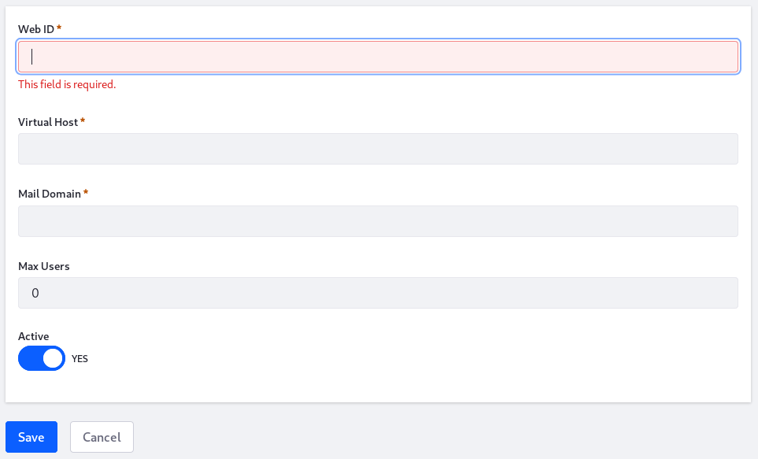

# Adding a Virtual Instance

Before you do anything in Liferay DXP to add a Virtual Instance, you must configure its domain name in your network to point to your installed Liferay DXP system.

Once the domain name is ready, create the Virtual Instance:

1. Go to _Control Panel_ &rarr; _Configuration_ &rarr; _Virtual Instances_.

1. Click the _Add_ button (). This opens the _New Instance_ form.

1. Complete the New Instance form as follows:

**Web ID:** Specify the instance ID. Using the domain name is a common convention.

**Virtual Host:** Set the domain name you configured in your network. When people use the domain name, they are directed automatically to this instance.

**Mail Domain:** Enter the mail host's domain name for the Virtual Instance. Email notifications are sent from the instance using this domain.

**Max Users:** Set the maximum number of user accounts the Virtual Instance supports. Enter `0` to support unlimited users.

**Active:** Set the Virtual Instance to active or inactive. Inactive Virtual Instances aren't accessible to anyone, even the administrator.

Click _Save_ when you're done filling out the form.

Now you can navigate to the instance using its domain name. You're brought to what looks like a clean install of Liferay DXP. This is your new Virtual Instance! You can configure it any way you like.

What follows is a description of all Virtual Instance options.
