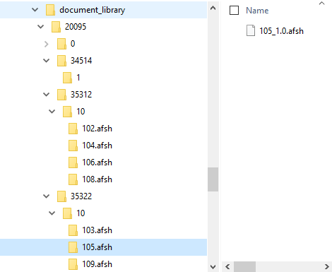
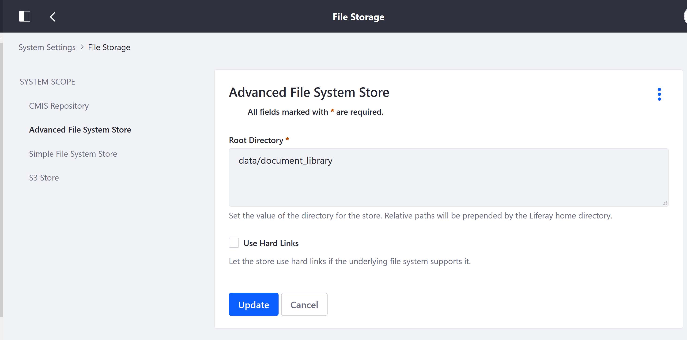

# Configuring File Storage

Widgets that store files (for example, [Documents and Media](../../../collaboration-and-social/collaboration-and-social-overview.md)) and that support file attachments (for example, [Message Boards](../../../collaboration-and-social/collaboration-and-social-overview.md)), use DXP's file store. The files are saved to and retrieved from the file store. The file store can be hosted on the local machine, on a network mounted file system, in a database, or in the cloud.

```important::
   If you are going to production, we highly recommend reviewing the various File Store configuration options and choosing the one that best fits your needs, **before** going live. Doing so can avoid painful file store migrations later in a project's life.
```

## Configuring Advanced File System Store

The Advanced File System Store programmatically creates a folder structure that can expand to millions of files, by alphabetically nesting the files in folders. This allows more files to be stored and helps to avoid the limitation that some operating system have on the number of files that can be stored per folder. Storing fewer files per folder also improves file lookup performance.



To use the Advanced File System store method, following these steps:

1. Configure [`portal-ext.properties`](../../../installation-and-upgrades/reference/portal-properties.md) with this property:

    ```properties
    dl.store.impl=com.liferay.portal.store.file.system.AdvancedFileSystemStore
    ```

1. Restart DXP.

1. In the Control Panel, navigate to _Configuration_ &rarr; _System Settings_ &rarr; _File Storage_.

1. In the _Advanced File System Store_ screen, set the _Root Directory_ to your [Liferay Home](../../../installation-and-upgrades/reference/liferay-home.md) path (absolute or relative).

    

1. Click _Save_.

DXP is now saving files using Advanced File System Store.

### File Storage in a Clustered Environment

In a [clustered environment](../../../installation-and-upgrades/setting-up-liferay-dxp/configuring-clustering-for-high-availability/01-introduction-to-clustering-liferay-dxp.md), point the store to a network mounted file system that all the nodes can access. The networked file system must be accessible to all nodes, support concurrent requests, and support file locking. If Advanced File System Store is used without such a file system and multiple users attempt writing to the same file concurrently, data corruption can occur.

## Other File Storage Topics

### Other File Storage Methods

Liferay DXP also ships with several other file storage methods that can be configured, depending on your project's needs.

* [Simple File System Store](./other-file-store-types/simple-file-system-store.md) uses the file system (local or a mounted share) to store files. This is the *default* file store.

* [S3 Store (Amazon Simple Storage Service)](./other-file-store-types/amazon-s3-store.md) uses Amazon's cloud-based storage.

* [DBStore (Database Storage)](./other-file-store-types/dbstore.md) stores files to the DXP database as `blobs`. DBStore's file size limit is 1 gigabyte. To store files larger than 1 gigabyte, use the Simple File System Store or the Advanced File System Store.

```warning::
   File system based stores (Simple, Advanced, S3) do not have transaction rollback capability. If a database transaction rollback occurs in a Document Library, the transaction's file system changes are not reversed. Inconsistencies between Document Library files and those in the file system store can occur and may require manual synchronization. All stores except `DBStore <./other-file-store-types/dbstore.md>`_ are vulnerable to this limitation.
```

### Migrating Files Across File Stores

The Data Migration utility moves files from one store option to another. For example, it can be used to migrate files from a Simple File System Store (the default store) to an Advanced File System Store to leverage performance and scalability benefits. See [File Store Migration](./file-store-migration.md) for more information.
