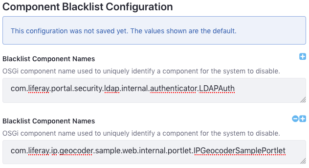

# Blacklisting OSGi Components

The Component Blacklist is a convenient way to manage multiple [OSGi Declarative Service Components](https://help.liferay.com/hc/articles/360028846452-Declarative-Services) (components). The list is an [OSGi configuration](../../system-settings/using-configuration-files.md#creating-configuration-files) that DXP uses to disable components. These lists save you the trouble of modifying them individually with the [Application Manager](./using-the-app-manager.md) or [Gogo shell](../../../liferay-internals/fundamentals/using-the-gogo-shell/using-the-gogo-shell.md).

The blacklist can be exported from the Control Panel to an OSGi configuration (`.config`) file. Modifying the file and deploying it to DXP has these additional effects:

* Persists the changes across DXP server startups
* Propagates the changes from a local cluster node to all the other nodes.

Blacklisting components using the UI and a config file is demonstrated.

## Blacklisting Components

Follow these steps to disable OSGi components:

1. In the Control Panel, navigate to *Configuration* &rarr; *System Settings* &rarr; *Module Container*. The Component Blacklist screen appears.

1. In the Component Blacklist screen, add the names of components to disable, and click the *Save* button. The components disable immediately.

    

1. To export the blacklist, click on the Component Blacklist module's Actions button () and then click *Export*. The blacklist configuration file then downloads (`com.liferay.portal.component.blacklist.internal.ComponentBlacklistConfiguration.config`). Here are contents of the file produced from the example list:

    ```properties
    blacklistComponentNames=["com.liferay.portal.security.ldap.internal.authenticator.LDAPAuth","com.liferay.ip.geocoder.sample.web.internal.portlet.IPGeocoderSamplePortlet "]
    ```

1. Add the names of any components not already listed (e.g., components of modules not yet installed) that you want to prevent from enabling.

    ```important::
       Configuration values can't contain extra spaces. Extra spaces can short-circuit lists or invalidate the configuration entry.
    ```

1. To deploy the configuration file, copy it into the folder `[Liferay Home]/osgi/configs`. The Liferay Home folder is typically the app server's parent folder.

## Re-enabling Blacklisted Components

To re-enable and permit enabling of blacklisted OSGi components, follow these steps:

1. Open the configuration file `[Liferay Home]/osgi/configs/com.liferay.portal.component.blacklist.internal.ComponentBlacklistConfiguration.config`.

1. Remove the names of the components from the `blacklistComponentNames` list and save the file.

To enable *all* the blacklisted components, remove the configuration file.

```note::
   To temporarily re-enable a blacklisted component, remove its name from the Component Blacklist Configuration module in System Settings and click *Update*. If you're using a component blacklist config file (in the ``[Liferay Home]/osgi/configs`` folder) and want the component to enable on subsequent server startup, make sure to remove the component's name from the file.
```

Congratulations! Now you can manage multiple components using a simple list.

## Additional Information

* [Blacklisting Apps](./blacklisting-apps.md)
* [Managing Apps](./using-the-app-manager.md)
* [Using the Felix Gogo shell](../../../liferay-internals/fundamentals/using-the-gogo-shell/using-the-gogo-shell.md)