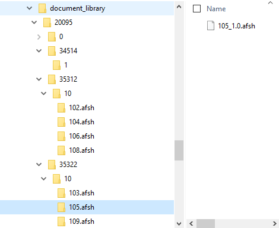
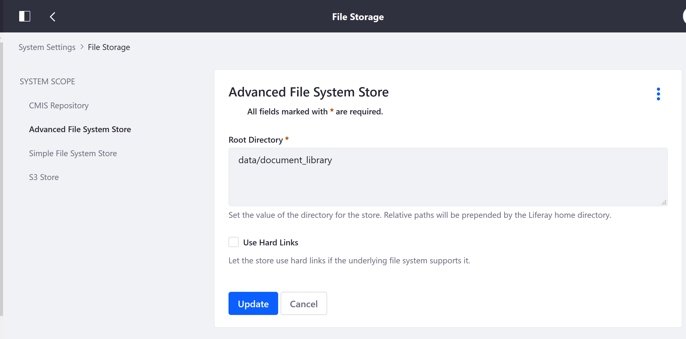

# Advanced File System Store

The Advanced File System Store is similar to the [Simple File System Store](./simple-file-system-store.md) (the default store) in that it saves files to a file system (local or a mounted share). It's different in that it uses a more nested folder structure.



The Advanced File System Store programmatically creates a structure that can expand to millions of files, by alphabetically nesting the files in folders. This allows more files to be stored and helps to avoid the limitation that some operating system have on the number of files that can be stored per folder. Storing fewer files per folder also improves file lookup performance.

## Configuring the Store

Configure the store following these steps:

1. Configure [`portal-ext.properties`](../../../installation-and-upgrades/reference/portal-properties.md) with this property:

    ```properties
    dl.store.impl=com.liferay.portal.store.file.system.AdvancedFileSystemStore
    ```

1. Restart DXP.

1. In the Control Panel, navigate to _Configuration_ &rarr; _System Settings_ &rarr; _File Storage_.

1. In the _Advanced File System Store_ screen, set the _Root Directory_ to your [Liferay Home](../../../installation-and-upgrades/reference/liferay-home.md) path (absolute or relative).

    

1. Click _Save_.

DXP is now saving files to the Advanced File System Store.

## Using the Store in a Clustered Environment

In a [clustered environment](../../../installation-and-upgrades/setting-up-liferay-dxp/configuring-clustering-for-high-availability/01-introduction-to-clustering-liferay-dxp.md), point the store to a network mounted file system that all the nodes can access. The networked file system must be accessible to all nodes, support concurrent requests, and support file locking. If Advanced File System Store is used without such a file system and multiple users attempt writing to the same file concurrently, data corruption can occur.

## Database Rollback Limitation

**Warning:** If a database transaction rollback occurs in a Document Library, the transaction's file system changes are **not** reversed. Inconsistencies between Document Library files and those in the file system store can occur and may require manual synchronization. All of the DXP stores except [DBStore](./dbstore.md) are vulnerable to this limitation.

## Additional Information

* [File Storage Overview](./file-storage.md)
* [Amazon S3 Store](./amazon-s3-store.md)
* [DBStore](./dbstore.md)
* [File Store Migration](./file-store-migration.md)