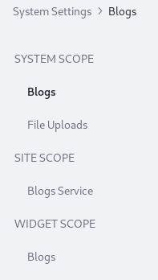
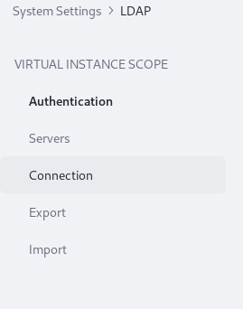
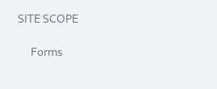
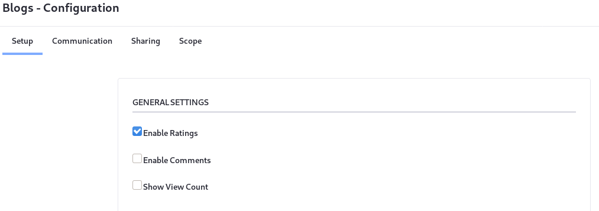

# Understanding Configuration Scope

Settings for Liferay DXP's services and applications are applied at one of four levels, or _scopes_: System, Virtual Instance, Site, or Widget.



**System Scope:** Configuration made for system scoped entries becomes the final value for the application in a system-wide fashion. It affects the whole system and isn't overridden anywhere else. 


**Virtual Instance Scope:** Configuration at the Virtual Instance level is overridden in Instance Settings.



**Site Scope:** Configuration at this scope is overridden in each Site. 



**Widget Scope:** Configuration at this scope is overridden in each Widget Instance.


All settings made from System Settings act at the system scope. For scopes labeled other than System, the System Settings values act as defaults. In other words, they identify where the system-wide configuration is overridden. True system-scoped configurations (those under a category's _System Scope_ heading) are not overridden anywhere. 

## Example: Configuring and Overriding Blogs Comments

If a configuration changed in System Settings is also configurable at a different scope, the System Settings value is a default that can be overridden. Once a configuration change is made at a more granular scope, a change at the system level does nothing. 

For example, allowing comments is configurable for each Blogs widget. Set the default behavior at Control Panel &rarr; Configuration &rarr; System Settings &rarr; Blogs (in the Content and Data category). In the Blogs Entry under Widget Scope, disable the *Enable Comments* checkbox. 

Now add a Blog Entry to a Site's Content & Data &rarr; Blogs application. Then go to a public page and add the Blogs Widget to the page. Click the Options button () for the widget and select *Configuration*. You'll see the same Enable Comments checkbox, and its default is now false (unchecked). Checking the box in the Widget Configuration screen breaks its link with the System Settings entry. Changing the System Settings configuration has no effect on this widget anymore.



```note::
   Instance Settings is similar to System Settings, but configures applications and services at the Virtual Instance scope. Like System Settings, the configuration entries in Instance Settings have a *Reset to Default Values* option. In Instance Settings, this removes the custom configuration you provided and makes the current value (whether default or custom) from the system scope the default at the virtual instance scope.
```
