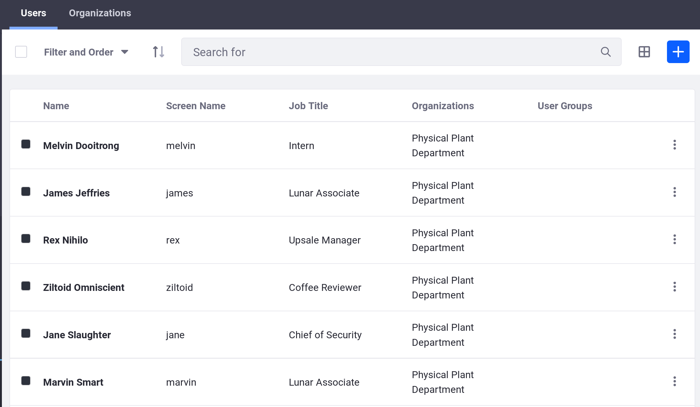
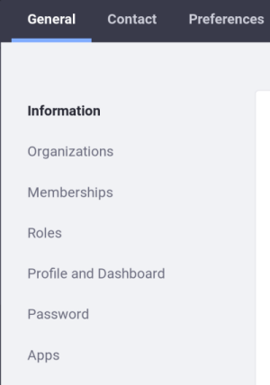
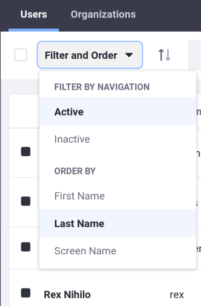

# Adding, Editing, and Deleting Users

At the root of managing Users is adding, editing, and deleting them. As long as you're the Administrative user, you can do all these things and more. 

## Adding Users

Here's how to add Users: 

1.  From the Product Menu, click *Control Panel* &rarr; *Users* &rarr; *Users and Organizations*. 
1.  In the Users tab, click the *Add* button [Add](./images/icon-add.png).
    
1.  Fill out the Add User form and click *Save*. At a minimum, provide a Screen Name, First Name, Last Name, and Email Address for the User.

    **Note:** Screen names and email addresses are not interchangeable. A screen name cannot contain an `@` symbol because it is used in the URL to a User's private page.

    The Add User functionality is split over several independent forms. Save the first form to create the User, and then you'll see a success message saying

    ```
    Success. Your request completed successfully. 
    ```

After submission of the first form a larger form with many sections appears. The first is the Information section. To the left is a navigation pane where you can continue configuring the user you're adding by clicking through the available sections. The options in the left menu change as you click through the tabs at the top. Peruse the sections for the three tabs (General, Contact, Preferences) and fill in all the applicable information.



You don't have to fill anything else out right now. Just note that when the user account was created, a password was automatically generated. If Liferay was correctly installed and a [mail server was set up](../system-management/05-server-administration.md), an email message with the User's new password was sent to the User's email address.

If you haven't set up a mail server, click the *Password* item from the General menu and manually set a password for your new user. Enter the new password twice.


## Editing Users

If you click on *Users and Organizations* in the Control Panel, you'll see your own user's account in the list of Users, along with any others. To change something about a particular user, click the *Actions* button () next to that user.

Choose *Edit* to modify any aspect of the User account.

Choose *Permissions* to define which Roles have permissions to edit the User.

Choose *Manage Pages* to configure the personal pages of a User.

Choose *Impersonate User* to browse the Site in another window as though you were that User. Now you can test that User's permissions or other settings to make sure you've configured things properly. 

Choose *Deactivate* to disable the user's account. The User is still in your database along with all the rest of your Users, but user cannot sign in to the portal. You can toggle between active and inactive Users in the Users view. If all the Users are active, this filtering option doesn't appear.

Choose *Erase Personal Data* to [delete the User's personal data](./03-managing-user-data/01-intro.md). 

Choose *Export Personal Data* to [download the User's personal data](./03-managing-user-data/03-exporting-user-data.md)



Most Users can't perform any of the above actions. In fact, most Users won't have access to the Control Panel at all. You can perform all of the above functions because you have administrative access.

## Deleting Users

To guard against accidental deletion of Users, a two-step process must be followed: deactivate, then delete.

1.  Find the User to delete in the Users tab of *Control Panel* &rarr; *Users* &rarr; *Users and Organizations*. If you have a lot of Users, save time by searching for the User.
1.  Click the *Actions* menu for the User and select *Deactivate*. You're asked to confirm that you want to deactivate the User. Click *OK*. 

    You'll see a success message and the User disappears, but isn't gone yet.
1.  By default the Users table displays only Active users. Click on *Filter and order* in the top of the table and a dropdown menu appears. Click *Inactive*, and you can see the User you just deactivated. 
1.  Click the Actions menu again, and click *Delete* if you really mean to delete the User. Confirm that you want to delete the User, and now the User is gone. This time, it's for real.

**Deactivated Users:** Deactivating a User means the User can't log in to the portal. He/she has no more permissions in the Sites and pages of the portal than a guest, although the account still exists in the system.

Users can be reactivated by finding them in the Users table (be sure you're filtering the table results by Deactivated users), clicking the Actions menu, and selecting Activate. There's no confirmation window for activation: they're automatically restored to their former status once Activate is clicked.

Now you understand the basic principles of User administration. To learn about password resets, creating administrative users, and more, keep reading.

