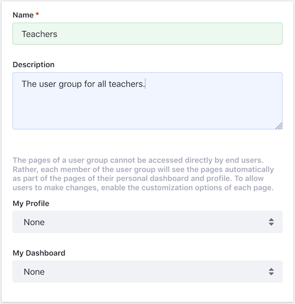
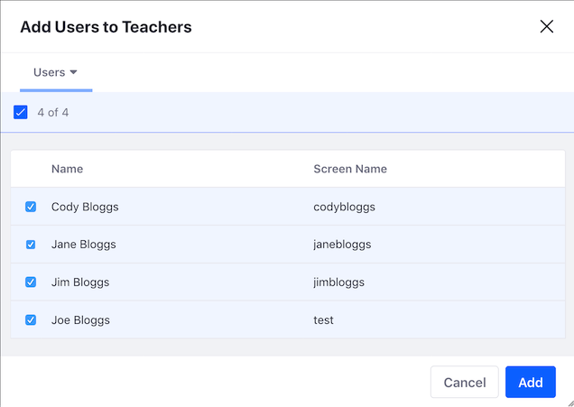
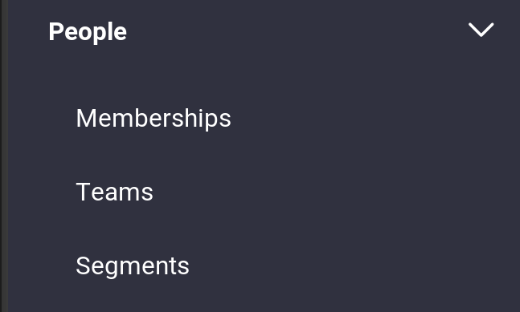
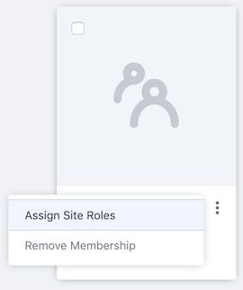
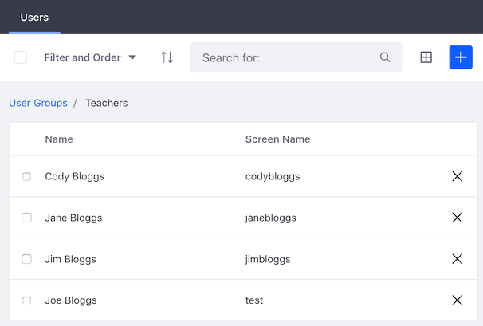
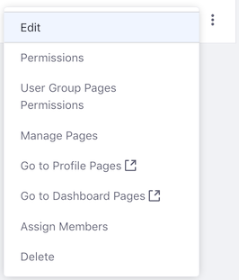

# Creating and Managing User Groups
SEARCH FOR user-groups in links
REPLACE WITH creating-and-managin-user-groups

A User Group is a list of Users created for a specific purpose. User Groups can be created across the hierarchical boundaries of [Organizations](../organizations/understanding-organizations.md). For example, an administrator could create a Teachers User Group for adding all members to multiple Sites, assign them all to a [Regular Role](https://help.liferay.com/hc/en-us/articles/360028819032-Roles-and-Permissions), and create a common set of profile pages for all teachers in the User Group. User Groups are integrated with Roles, Sites, Site Templates, and permissions. This flexibility means that there are many different use cases for User Groups. The articles in this section show you how to work with User Groups to serve the most common use cases.

User Groups are most often used in these scenarios:

- **Manage Site membership:** Grant Site membership to all Users in a User Group. Using the previous example, the Teachers User Group could be added as a member of the Sites *University Employees* and *Students and Teachers Collaboration*. All users in that User Group would become members of those Sites. 

- **Manage Users' personal pages:** Provide predefined public or private pages to the users in the User Group. For example, the Teachers User Group could be created to ensure the home page on all teachers' personal Sites has the same layout and applications. 

- **Collect permissions:** Assign Roles and permissions to a group of Users that don't share an organization. For example, in a university's portal, a User Group could be created to group all teachers independently of their departments (organization). This would make it easier to assign one or several Roles at once to all the teachers. 

Read on to learn how to manage User Groups. 

## Creating a User Group

Follow these steps to create a User Group: 

1. Open the Menu () and select *Control Panel* &rarr; *Users* &rarr; *Users Groups*. Any existing User Groups appear here in a table. 

1. Click the *Add* button ().  This opens the *New User Group* form. 

1. Give your User Group a name and description. 

1. If you want to create My Profile and/or My Dashboard pages for the User Group's members, select a Site Template to use from the *My Profile* and *My Dashboard* selector menus. 

1. Click *Save*. The new User Group then appears in the table. 

Note that new User Groups don't have any Users. The next section shows you how to add members to a User Group. 

## Assigning Members to a User Group

Follow these steps to add existing users to a User Group: 

1. If you're not already there, open the Menu () and select *Control Panel* &rarr; *Users* &rarr; *Users Groups*. The available User Groups appear here in a table. 

1. Click *Actions* () &rarr; *Assign Members* for the User Group you want to add users to. The group's existing users appear in a table. 

1. Click the *Add* button ().  This opens a list of the users you can select. 

1. Select one or more users from the list, then click *Add*. This adds the selected users to the group, and returns you to the table containing the group's users. The users you added now appear in the table. 

## Configuring User Group Permissions

Administrators commonly create User Groups so the group's Users can take some specific action in a Site. This is done by assigning the permissions for that action to a Role, and then assigning that Role to the User Group. This grants the Role's permissions to the User Group's Users. 

Follow these steps to grant permissions to Users in a User Group: 

1. Create the User Group.
1. Assign the User Group to a Site.
1. Create the Site Role and define its permissions.
1. Assign the Role to the User Group.

For instructions on the first three steps, click those links above. This article shows you how to assign a Role to a User Group:

1. Open the Menu (), select the Site to work in, then open its Site Administration menu. 

1. In the Site Administration menu, select *People* &rarr; *Memberships*.  This opens the Memberships screen. 

   

1. In Memberships, select the *User Groups* tab. This tab displays User Groups currently assigned to the Site. 

1. Click the *Actions* button () for the User Group you want to assign to a Role, and select *Assign Site Roles*. This opens the Assign Site Roles dialog. 

   

1. In the Assign Site Roles dialog, select the Role from the list and click *Done*. 

## Editing User Groups

You can access User Groups from *Control Panel* &rarr; *Users* &rarr; *User Groups*. Managing membership is the most common action you'll likely perform on a User Group. 

Follow these steps to add/remove users to/from a User Group: 

1. Click the User Group's name or description. Alternatively, you can click the User Group's *Actions* button () and select *Assign Members*. This presents a list of the User Group's users. 

1. To remove a User from the User Group, click the `X` button next to that User. To remove multiple Users at once, check each User's checkbox and then click the trash icon () that appears in the Management Bar above the User list. 

1. To add Users to the User Group, click the *Add* button (). In the dialog that appears, select the Users and click *Add*. 

Other options are available in each User Group's Actions button (): 

**Edit:** Modify the User Group's name or description, or choose Site templates to use for the [User Group's Sites](./user-group-sites.md).

**Permissions:** Assign permissions for viewing and managing the User Group. 

**User Group Pages Permissions:** Assign permissions for managing the User Group's Site pages. 

**Manage Pages:** Manually manage the User Group's Site pages. See the [documentation on User Group Sites](#creating-user-group-sites-manually) for details. 

**Assign Members:** Add/remove Users to/from the User Group. This is described in detail above. 

**Delete:** Remove the User Group. Note that you can't delete a User Group that contains Users. You must first remove the Users from the group. 

If your User Group has public and private Site pages, the options *Go to Profile Pages* and *Go to Dashboard Pages* also appear in your User Group's Actions menu. Clicking one of these links opens that Site in a new browser window. See the [documentation on User Group Sites](#user-group-sites) for details. 

 
