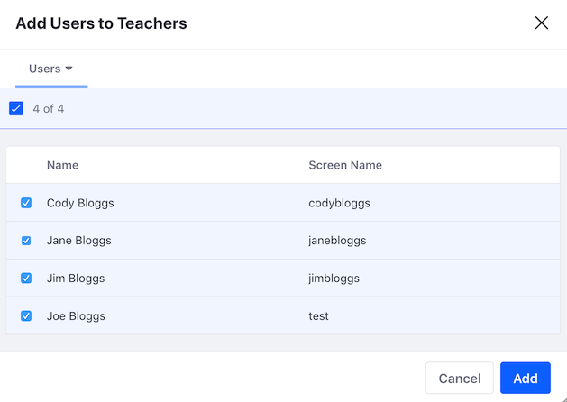
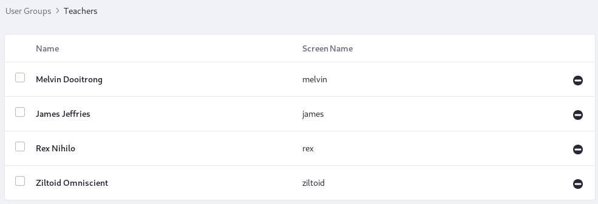

# Creating and Managing User Groups

A User Group is a list of Users created for a specific purpose. User Groups can be created across the hierarchical boundaries of [Organizations](../organizations/understanding-organizations.md). For example, an administrator could create a Teachers User Group for adding all members to multiple Sites, assign them all to a [Regular Role](../roles-and-permissions/README.md), and create a common set of profile pages for all teachers in the User Group.

Here you'll learn how to work with User Groups to serve the most common use cases.

| Use Case                     | Description                                                                                                                                                                                                                                                                                                             |
| ---------------------------- | ----------------------------------------------------------------------------------------------------------------------------------------------------------------------------------------------------------------------------------------------------------------------------------------------------------------------- |
| Manage Site membership       | Grant Site membership to all Users in a User Group. Using the previous example, the Teachers User Group could be added as a member of the Sites _University Employees_ and _Students and Teachers Collaboration_. All users in that User Group would become members of those Sites.                                     |
| Manage Users' personal pages | Provide predefined public or private pages to those in the User Group. For example, the Teachers User Group could be created to ensure the home page on all teachers' personal Sites has the same layout and applications.                                                                                              |
| Collect permissions          | Assign Roles and permissions to a group of Users that don't share an organization. For example, in a university's portal, a User Group could be created to group all teachers independently of their departments (organizations). This would make it easier to assign one or several Roles at once to all the teachers. |

## Creating a User Group

To create a User Group,

1. Open the Menu () and select _Control Panel_ &rarr; _Users_ &rarr; _Users Groups_. Any existing User Groups appear here in a table.

1. Click the _Add_ button () to open the _New User Group_ form.

1. Give your User Group a name and description.

1. If you want to create My Profile and/or My Dashboard pages for the User Group's members, select a Site Template from the _My Profile_ and _My Dashboard_ selector menus.

1. Click _Save_. The new User Group appears in the table.

New User Groups don't have any Users until you add them.

## Assigning Members to a User Group

To add existing users to a User Group,

1. Open the User Groups application (_Control Panel_ &rarr; _Users_ &rarr; _Users Groups_). The available User Groups appear.

1. Click _Actions_ () &rarr; _Assign Members_ for the User Group. The group's existing users appear in a table.

1. Click the _Add_ button () to see a list of the Users you can select.

1. Select Users from the list, then click _Add_. This adds the selected Users to the group and shows the list of Users in the group.

## Configuring User Group Permissions

User Group Users might need to take certain actions, whether across the system or in a specific Site. Regardless of the scope, access is granted by assigning the needed permissions for the action to a Role, and then assigning that Role to the User Group. Once given a Role with permissions assigned, the User Group's Users can get to work.

To give User Groups permissions at the portal-wide scope, you'll need a Regular Role.

1. Create a Regular Role and define its permissions (see [Roles and Permissions](https://help.liferay.com/hc/en-us/articles/360028819032-Roles-and-Permissions) for more information).
1. Once the Role is created, assign the User Group to it by clicking the title of the Role in _Control Panel_ &rarr; _Users_ &rarr; _Roles_.
1. Open the _Assignees_ tab.
1. Open the _User Groups_ panel.
1. Click the Add icon ().
1. Select the User Group and click _Add_.

To learn more about User Groups and Site-scoped management, see [Managing Site Membership and Permissions with User Groups](./managing-site-membership-and-permissions-with-user-groups.md).

## Editing User Groups

You can view and edit existing User Groups from _Control Panel_ &rarr; _Users_ &rarr; _User Groups_.

Follow these steps to add/remove users to/from a User Group:

1. Click the User Group's name or description to see a list of the User Group's current Users.

1. To remove a User from the User Group, click the `-` button next to that User. To remove multiple Users at once, check each User's check box and then click the `-` icon in the Management Bar above the User list.

1. To add Users to the User Group, click the _Add_ button (), select the Users, and click _Add_.

Other management options are available in each User Group's Actions menu ():

**Edit:** Modify the User Group's name or description, or choose Site Templates to use for the [User Group's Sites](./user-group-sites.md).

**Permissions:** Assign permissions for viewing and managing the User Group.

**User Group Pages Permissions:** Assign permissions for managing the User Group's Site pages.

**Manage Pages:** Manually manage the User Group's Site pages. See [User Group Sites](./user-group-sites.md#creating-user-group-sites-manually) for details.

**Assign Members:** Add/remove Users to/from the User Group (described above).

**Delete:** Remove the User Group. Note that you can't delete a User Group that contains Users. You must first remove the Users from the group.

If your User Group has public and private Site pages, the options _Go to Profile Pages_ and _Go to Dashboard Pages_ also appear in your User Group's Actions menu. Clicking one of these links opens that Site in a new browser window. See [User Group Sites](./user-group-sites.md) for details.

