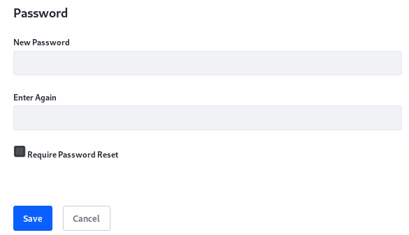

# Adding and Managing Users

Core user management activities include adding, editing, and deleting users. This activities are typically restricted to Administrative users.

## Adding Users

Here's how to add Users:

1. From the Product Menu, click *Control Panel* &rarr; *Users* &rarr; *Users and Organizations*.
1. In the Users tab, click the *Add* button .

    

1. Fill out the Add User form and click *Save*. At a minimum, provide a Screen Name, First Name, Last Name, and Email Address for the User.

    **Note:** Screen names and email addresses are not interchangeable. A screen name cannot contain an `@` symbol because it is used in the URL to a User's private page.

    The Add User functionality is split over several independent forms. Save the first form to create the User, and then you'll see a success message saying

    ```
    Success. Your request completed successfully.
    ```

After adding the user, additional information can be added.

### Setting Passwords for New Users

When a user account is created, a password is automatically generated. If a [mail server was set up](../system-management/05-server-administration.md), an email message with the User's new password is sent to the User's email address.

If you haven't set up a mail server, click the *Password* item from the General menu and manually set a password for your new user. Enter the new password twice.



## Editing Users

To edit a particular user:

1. Click on *Users and Organizations* in the Control Panel

1. Click the *Actions* button () next to that user to edit.

1. The following options are available:

    | Option | Description |
    | --- | --- |
    | Edit | Modify any aspect of the User account. |
    | Permissions | Define which Roles have permissions to edit the User. |
    | Manage Pages | Configure the personal pages of a User. |
    | Impersonate User <!-- might require another article covering this topic? --> | Browse the Site in another window as though you were that User. |
    | Deactivate | [Disable the user's account](#deactivating-users). |
    | Erase Personal Data | [Delete the User's personal data](./03-managing-user-data/01-intro.md). |
    | Export Personal Data | [Download the User's personal data](./03-managing-user-data/03-exporting-user-data.md). |

<!-- Now you can test that User's permissions or other settings to make sure you've configured things properly. -->

<!-- The User is still in your database along with all the rest of your Users, but user cannot sign in to the portal. You can toggle between active and inactive Users in the Users view. If all the Users are active, this filtering option doesn't appear. -->

<!-- Consider moving this info to a separate article on "Deactivating / Deleting Users"


-->

## Deactivating and Deleting Users

### Deactivating Users

Deactivating a user disallows the user from logging in to Liferay DXP. This effectively reduces the user's permissions to Sites and pages of the portal to guest. Deactivated still exist in the database with other Users. You can toggle between active and inactive Users in the Users view. If all the Users are active, this filtering option doesn't appear.

To deactivate a user:

1. Navigate to *Control Panel* &rarr; *Users* &rarr; *Users and Organizations* to locate the user to deactivate.
1. Click the *Actions* () menu for the User and select *Deactivate*

The user is now deactivated and can no longer log in. Users can be reactivated by finding them in the Users table (be sure you're filtering the table results by Deactivated users), clicking the Actions menu, and selecting Activate. There's no confirmation window for activation: they're automatically restored to their former status once Activate is clicked.

### Deleting Users

To guard against accidental deletion of Users, users must be deactivated first, and then can be deleted.

To delete a user:

1. Deactivate the user.
1. Click on *Filter and order* in the top of the table and a dropdown menu appears. Click *Inactive*, and you can see the User you just deactivated.

    

1. Click the Actions menu again, and click *Delete* if you really mean to delete the User.

The user is deleted. There is no way to recover the user once deleted besides restoring from a prior backup.

## Impersonating Users

Impersonating users allows you to view the system with the permissions the user would see it. This helps to diagnose issues an administrator can't see, such as making sure a user doesn't have access to sensitive data. Only users with the Administrator role are able to impersonate.

1. Click Control Panel &rarr; *Users and Organizations* to see the list of users and find the one you want to impersonate.
1. Click that user's *Actions* button ().
1. Click *Impersonate User*.

This opens another browser window logged in as that user.

## Resetting a User Password

The Add User functionality includes a *Require Password Reset* check box at the bottom of the Password form. The default password policy does not allow administrators to de-select this option. You can, however, modify the default password policy so that this box becomes usable.

1. Navigate to *Password Policies* in Control Panel &rarr; Users.
1. Click on the *Default Password Policy*.
1. De-select the *Change Required* switcher in the Password Changes section. Now you can decide whether users you add must reset their passwords.

See [Password Policies](../../devops/password-policies.md) for more information on editing the default policy or creating your own.

## Related Information

* Related
* Links
