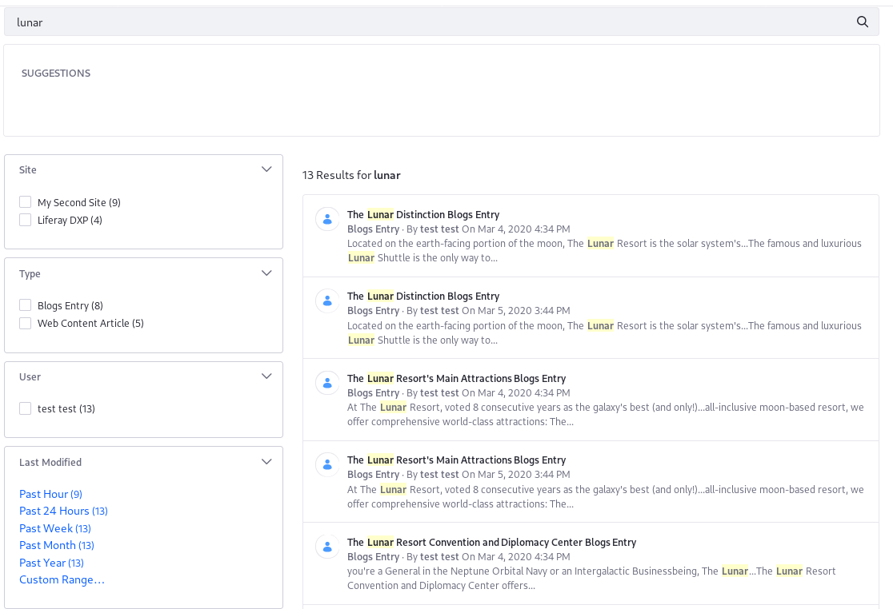
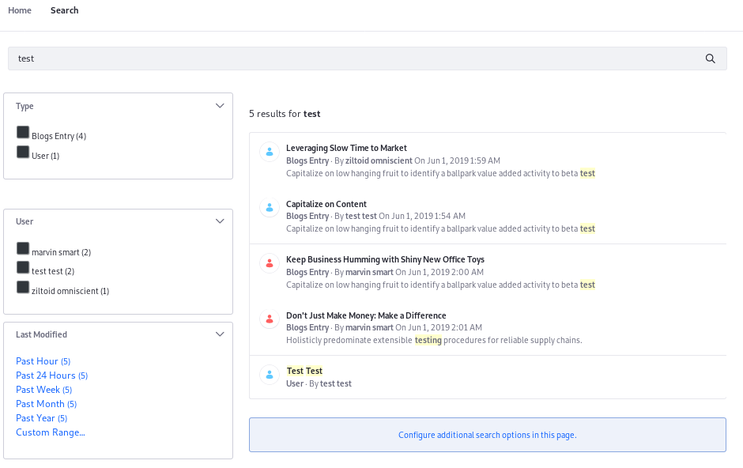
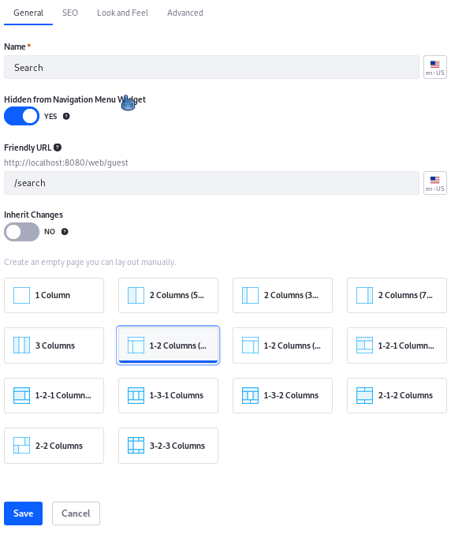
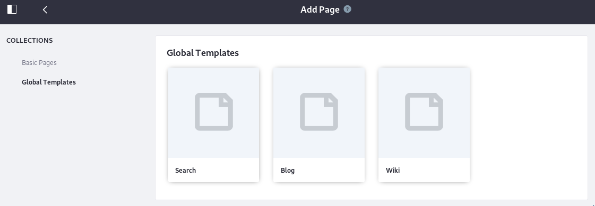

# Working with Search Pages

If you have a running Liferay DXP with some content in it, navigate to [localhost:8080/web/guest/search](http://localhost:8080/web/guest/search). This is the default search page, a hidden page in the default site that's based on a Globally scoped page template. Search pages are where users go to enter search terms and browse search results. Users with the proper permissions can add, remove, and configure the Page's search widgets to provide the precise search experience needed for the Site's Users. While Search Pages are highly configurable, the [default](#default-search-pages) configuration is handy. It provides a sensible starting point that can be modified later, as needed.

Newly created sites do not get a Search Page created by default. You'll need to create one. You can use the page template or, if you're in need of a fully customized experience, [build your own search page from the ground up.](#manual-search-page-configuration)

After choosing your approach and reading here to get your search page up and running, read through the more detailed articles on the various search widgets and the configuration documentation to understand the full suite of configuration options. 

##  Search Page Templates

The default search page is backed by a Global scope page template, and manually created search pages can use the template, too. The template can be used in two ways:

1. Enable inheriting changes to the template, if you want the search page to get any updates made to the template at a later date. 
1. Create a page based on the template, but independently configure it after the initial creation.

Out-of-the-box, the Search Page Template includes a Search Bar, Search Results, Search Suggestions, Search Options, and a bunch of Search Facets:

By default, all widgets use the _Barebone_ Application Decorator: unless there's content to render in the widget, the widget body is hidden. The header and the widget options icon are displayed if you hover over the widget with your mouse. Because of this, when you visit a search page created from the default search page template, you won't see certain widgets fully rendered.

By contrast, when you add a search widget to a page manually, they use the _Borderless_ decorator (by default), which shows more of the widget even when there is no content to display.

## Default Search Pages

Using the default site and the default theme with the default search settings, the search experience has two components for end users:

1. A search bar embedded in the header of each page.
1. A default search page where search requests are routed and results are displayed.

Behind the scenes, The search bar widget points to a hidden search page with the friendly URL `/search`.

Enter a search term and you're redirected to the default search page, where results are displayed in the Search Results widget.

The default search page is based on the Search page template, but it doesn't inherit changes from the template by default. That means you can customize the search page directly without changing the template's inheritance configuration.

If you require just a few changes to the default page, don't abandon it and create one manually. Just make the configuration changes you need, including adding, configuring, and removing widgets on the page. On the other hand, if you want a clean break from the default search page, starting from scratch is an option.

## Manual Search Page Configuration

These steps show you how to switch to a manually configured search experience in the default site, but you can skip the step on deleting the default search page if you're starting with a new site:

1. Delete the default search page by navigating to the default site's menu and clicking *Site Builder* &rarr; *Pages*. Click the Search page's Actions menu icon () and select *Delete*. Confirm you want to delete the page, and it's gone.

    Once deleted, the search bar disappears from your site pages, replaced by a warning message visible only to site administrators:

    

1. Create a new page named whatever you want (_Finders Keepers_, perhaps). Make it hidden or add it to the navigation as you please (the default search page is hidden from the navigation).

    If you want a pre-configured search page, create it from the Search page template. Find the template in the Add Site Page form. It's under *Global Templates*.

    

1. If you're creating a page not backed by the template, add and configure all the widgets you need. You'll find all the available search widgets in the Add Widget menu's Search section. Lay them out however you want on the page.

1. Configure the search bar at the top of the page, making sure it points to your new search page's friendly URL (for example, `/finders-keepers`). 

    Click the Search Bar widget's Options menu ().

    Click *Configuration* and set the Destination Page to the search page's friendly URL.

    Click *Save*.

Now your search page is up and running.

