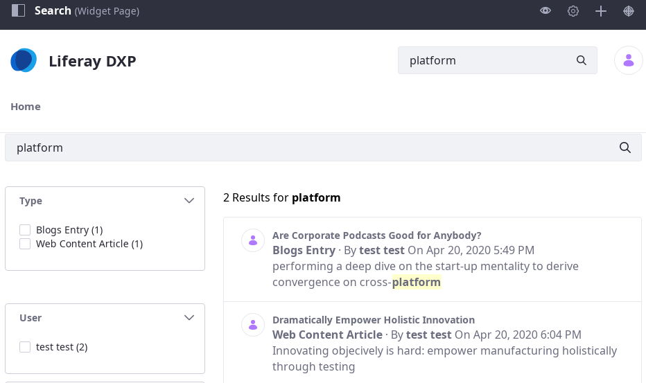

# Search Results

Search results are affected by multiple factors: 

* How assets are indexed
* The search widgets used
* Whether results are post-processed

Developers of a content type (an _asset_ in Liferay DXP) control much about how the asset's information is stored in the search engine (this process is called *indexing*) and how its information is searched and returned in the search results. Developers can use an *Indexer Post Processor* to modify an asset's indexing behavior and how search queries are constructed to look up the assets.

There are various ways to configure Search Results behavior:

[**Understanding Search Results:**](./understanding-search-results.md) Understanding why particular results appear and what to do to optimize search results. 

[**Configuring the Search Results Widget:**](./configuring-the-search-results-widget.md) The Search Results Widget is the UI for displaying the results of search queries. 

[**Filtering Results:**](./filtering-search-results.md) Making sure users can display only the most relevant results. 

[**Sorting Results:**](./sorting-search-results.md) Putting users in control of result order. 

Keep in mind though, almost everything you do when [configuring search](../../search_administration_and_tuning.rst) has an impact on search results. In addition to the Search Results widget and the supporting widgets that impact Search Results directly, there's a Control Panel menu called Search Tuning with two entries that directly impact Search Results:

1. [Synonym Sets](./../../search-administration-and-tuning/synonym-sets.md)
2. [Result Rankings](../../search-administration-and-tuning/result-rankings.md)

