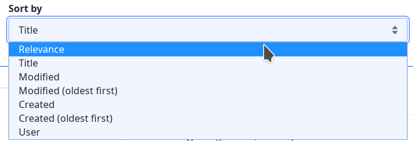
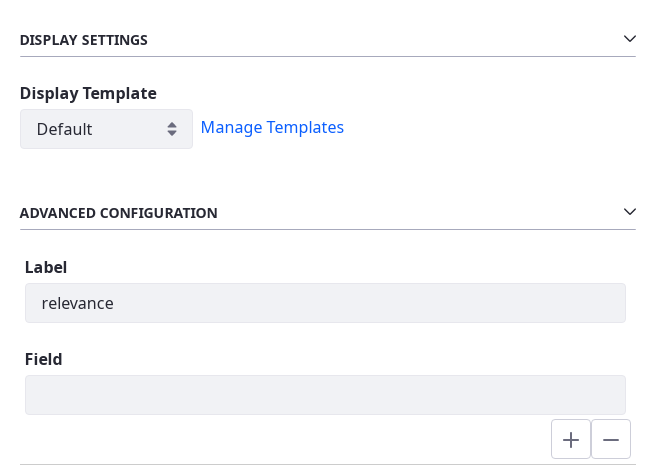

# Sorting Search Results

Search results displayed in the [Search Results](./search-results.md) widget are ordered by [relevance score](./search-results.md#search-results-relevance) (as calculated by the [search engine](https://www.elastic.co/guide/en/elasticsearch/guide/master/scoring-theory.html)) by default. With the Sort widget, users can control the order of returned results.

Add the widget to a [Search Page](../working-with-search-pages/search-pages.md) to begin sorting results.

Out of the box, you can order results in these ways as an alternative to relevance sorting:

-   alphabetically by Title
-   by the Modified date (newest first by default, or choose oldest first)
-   by the Create date (newest first by default, or choose oldest first)
-   alphabetically by the User that created each matching asset

Choose from one of the Sort widget's pre-configured sorting strategies or configure your own.

You can also delete unwanted sort options from the widget.

## Adding the Sort Widget to a Page

To get started with the Sort widget,

1. Open the Add menu () for the page and expand the Widgets section.

1. From the Search category, drag the Sort widget onto the page.

## Configuring the Sort Widget

From the Sort widget's Configuration screen, you can

-   Edit existing Sort options
-   Delete options
-   Add new options



To access the widget configuration screen, open the widget Options menu () and click _Configuration_.

Each Sort option has two settings: _Label_ and _Field_.

**Label:** Set the displayed label for the type of sort being configured.

**Field:** Enter the `fieldName` of the indexed field to sort. Most of the time this is a [keyword](https://www.elastic.co/guide/en/elasticsearch/reference/7.x/keyword.html) field. Other acceptable options are `date` and any [numeric datatype](https://www.elastic.co/guide/en/elasticsearch/reference/7.x/number.html). There's even a way to coerce `text` fields into behaving with the Sort widget (see below).



## Finding Sortable Fields

To find the fields available for use in the Sort widget, Users with the proper permissions can navigate to _Control Panel_ &rarr; _Configuration_ &rarr; _Search_. From there, open the Field Mappings tab and browse the mappings for each index. Scroll to the `properties` section of the mapping and find any `keyword` field, `date` field, or a field with a numeric data type. The `type` field is instructive:

    "type" : "keyword"

    "type" : "date"

    "type" : "long"

If you really must sort by a `text` field, add a new version of the field to the index with the type `keyword`. From the field mappings screen mentioned above, look at the `firstName` field in the index called `liferay-[companyID]`:

```
"firstName" : {
    "type" : "text",
    "store" : true
},
"firstName_sortable" : {
    "type" : "keyword",
    "store" : true
},
```

There's a corresponding field with the suffix `_sortable`, and of the correct type for sorting (`keyword`). The sortable field got there via a [portal property](https://docs.liferay.com/dxp/portal/7.3-latest/propertiesdoc/portal.properties.html#Lucene%20Search):

```properties
index.sortable.text.fields=firstName,jobTitle,lastName,name,screenName,title
```

All the text fields listed here have a `fieldName_sortable` counterpart created automatically in the index. To add more, copy this property into a [`portal-ext.properties`](./../../../installation-and-upgrades/reference/portal-properties.md) file into your Liferay Home folder, add any new field names you need to sort by, and restart the server.

## Adding New Sort Options

To sort by the new field or an existing field of the proper type, use the plus symbol below any existing option's _Field_ configuration make sure to use the `fieldName_sortable` version of the field in the widget configuration.

To add a new sort option that's already of the proper data type, use the plus symbol below any option's _Field_ configuration and fill in the fields. The order of options here in the configuration screen matches the order in the select list when configuring the widget for search.

## Editing and Deleting Sort Options

To edit an existing option, edit the text in its configuration section.

To delete an existing option, use the minus symbol below its _Field_ configuration.

## Controlling the Sort Order

To control the order for the sort option, add a plus or minus symbol after the `fieldName`. Look how it's done for the existing sort options labeled _Created_ and _Created (oldest first)_ to understand how it works:

**Label:** _Created_
**Field:** `createDate-`

The `-` sign following the field name indicates that the order is _descending_. Sorting this way brings search results created most recently to the top of the list.

**Label:** _Created (oldest first)_
**Field:** `createDate+`

The `+` sign following the field name indicates that the order is _ascending_. Sorting this way brings the oldest (by creation date) results to the top of the list.
