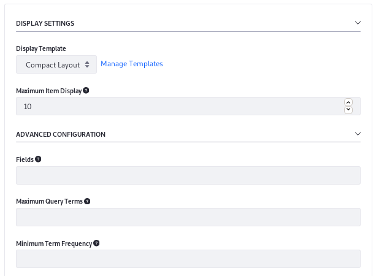
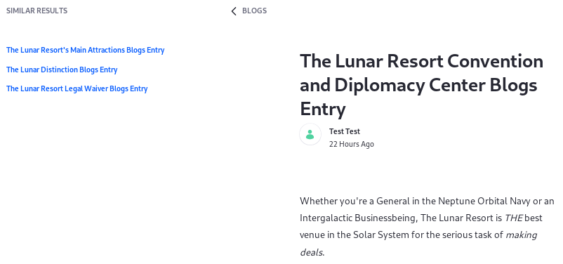
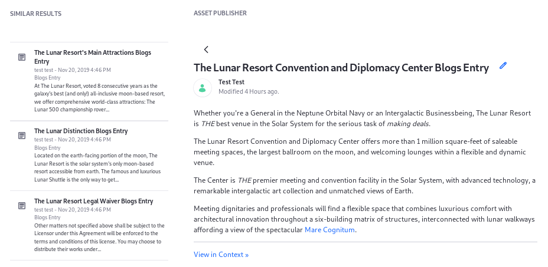
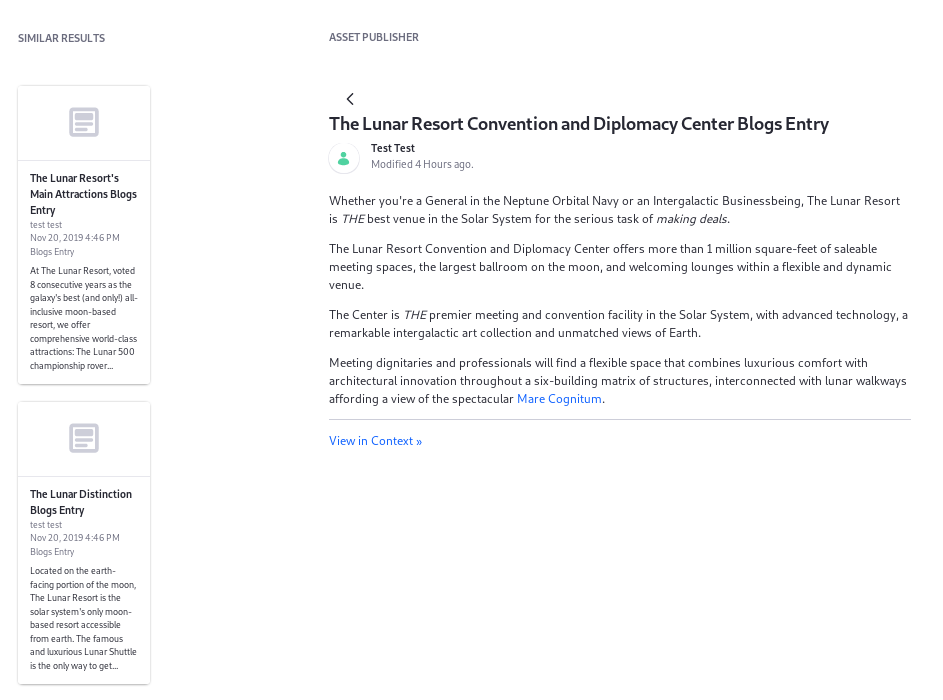

# Similar Results

> **Subscribers**

> **Availability:** Liferay Marketplace
<!-- please use a more generic example for screenshots (instead of lunar resort) -->
The Similar Results widget shows search results similar to the _main asset_ that's selected on the page.

The concept of the main asset is important. Certain widgets in DXP display lists of assets: Asset Publisher, Blogs, Wiki, and more. If a user clicks one of the displayed assets and the widget shows its full content on the page, it's now the page's _main asset_. The Similar Results widget, if placed on the same page, shows a list of assets that are similar enough to be returned by a [_More Like This_ query](https://www.elastic.co/guide/en/elasticsearch/reference/current/query-dsl-mlt-query.html). The concept of a main asset is synonymous with Elasticsearch's [_input document_](https://www.elastic.co/guide/en/elasticsearch/reference/current/query-dsl-mlt-query.html#_how_it_works).

Similar Results uses the input document/main asset to construct a query that returns itself as the best match to the query, and then sends this disjunctive query (or `OR`) to the search engine to return matching result documents. This process is configurable: how to process the input document, how to select terms from the processed content, and how to form the query itself. See the Elasticsearch documentation for the [details](https://www.elastic.co/guide/en/elasticsearch/reference/current/query-dsl-mlt-query.html#_parameters_4).

## Configuring the Similar Results Widget

1. Click the Add menu () &rarr; Widgets &rarr; Search and drag the Similar Results widget onto the page.

1. To configure it, open the widget Options menu () and click _Configuration_.

The full list of available properties is found [below](#similar-results-configurations).

## Using the Similar Results Widget

What happens when a Similar Results widget is placed on a page depends on the context and the assets currently displayed by the page. If no main asset is selected on the page, the Similar Results displays nothing: its space on the page remains blank. Site administrators see this informational message:

_There are no similar results available._

When a main asset's document is detected, the widget shows similar results of the same asset type, displayed in a format dictated by the configured [Widget Template](#similar-results-widget-templates).

Learn more by considering two use cases.

## Use Case 1: Similar Results on Asset Publisher Pages

Similar Results (those that would be returned as matching search hits) of the same asset type are displayed when an asset is selected in the Asset Publisher.

To configure this example,
<!-- One or two screenshots here would be beneficial. -->
1. Create a widget page. Add an Asset Publisher widget and a Similar Results widget.

1. Go to the Asset Publisher's configuration Display Settings and set Asset Link Behavior to _Show Full Content_.

    This makes a selected asset display its full content inside the Asset Publisher. If you choose _View in Context_, you're redirected to the page where the asset exists natively, making your Similar Results widget useless.

1. Create multiple similar assets of the types listed below. Make sure they're similar enough that the Similar Results widget would populate results.

    To create assets that will be returned by the More Like This Query, pay attention to the content of the assets you create and to the [Similar Results widget configuration](#similar-results-configurations).  For testing, it's advisable to set the _Minimum Term Frequency_ and the _Minimum Document Frequency_ values both to `1`.

    * Blogs Entries
    * Documents and Media files
    * Documents and Media folders
    * Web Content Articles
    * Web Content Folders
    * Wiki Pages
    * Message Boards threads
    * Message Boards messages
    * Message Boards categories

Click on an asset displayed by the Asset Publisher widget, and similar results appear in the Similar Results widget.

<!--  -->

Click on one of the similar results. The Asset Publisher updates its main asset, and Similar Results are recalculated for the new main asset.

## Use Case 2: Similar Results on Asset Display Pages

These widgets and accompanying assets can display a list of their assets and select one to be used as a Main Asset for the Similar Results widget:

| Widget Name | Asset Type(s) |
|---------------------|--------------------------------------------------|
| Blogs               | Blogs Entries                                    |
| Documents and Media | Documents and Media Files, Folders               |
| Wiki                | Wiki Pages                                       |
| Message Boards      | Message Boards Threads, Messages, and Categories |

To configure an example for using Similar Results with Blogs,

1. Create a widget page. Add a Blogs widget and a Similar Results widget.

1. Create multiple similar Blogs entries. Make sure they're similar enough that the Similar Results widget returns them as results.

    To create assets that will be returned by the More Like This Query, pay attention to the content of the assets you create and to the [Similar Results widget configuration](#similar-results-configurations).  For testing, it's advisable to set the _Minimum Term Frequency_ and the _Minimum Document Frequency_ values both to `1`.

1. Click on a Blogs post in the Blogs widget. The Blogs entry is displayed, and the Similar Results widget displays links to similar entries.

1. Click one of the similar results. Its Blog content is now rendered on the Blogs widget on the current page.

<!--  -->

## Similar Results Widget Templates

By default, similar results render using a _Compact Layout_ [widget template](https://help.liferay.com/hc/en-us/articles/360029132571-Styling-Widgets-with-Widget-Templates), showing a list of hyperlinked titles.

Two additional widget templates are available out of the box: _List Layout_ and _Card Layout_.

<!--The Compact Layout looks like this:
 -->

<!--The List Layout looks like this:
 -->

<!--The Card Layout looks like this:
 -->

### Add a Custom Widget Template for Similar Results

To write your own widget template for the Similar Results display,

1. Open the Similar Results widget Options menu () and click _Configuration_.

1. Click _Manage Templates_ to see the Widget Template screen.

1. Click the Add button () to open the template creator palette.

    In addition to the standard [widget template](https://help.liferay.com/hc/en-us/articles/360029132571-Styling-Widgets-with-Widget-Templates) variables, leverage the search-specific variables provided in the template editor.

1. Design the template to your liking. See the [widget template](https://help.liferay.com/hc/en-us/articles/360029132571-Styling-Widgets-with-Widget-Templates) documentation for more details.

The same template editor is accessible from the Widget Templates entry in the Site Menu's _Site Builder_ section.

## Similar Results Configurations

The first configuration options appear in a section called _Display Settings_.
<!-- Please consider reworking this list of configurations into a table for a better skimming experience along with a screenshot or two for a visual reference. -->
**Display Template:** Choose the widget template to configure how similar results are displayed.

**Maximum Item Display:** Set the maximum number of results to display in the widget.

The _Advanced Configuration_ section collects settings for tweaking the
behavior of the widget. Many of these settings are used to configure the
[More Like this Query for Elasticsearch](https://www.elastic.co/guide/en/elasticsearch/reference/current/query-dsl-mlt-query.html).

**Fields:** Use a comma-separated list to specify keyword or text fields whose content is
used to determine whether another asset matches the Main Asset.

**Maximum Query Terms:** Set the maximum number of query terms to extract from the main asset. These are the terms used for matching search results to the main asset. Increasing this value enhances the relevance of returned results at the expense of execution speed. If left blank, this defaults to `25`.

**Minimum Term Frequency:** Set the minimum threshold for the times a term must appear in the index to be used for matching similar results. If left blank, this defaults to `2`.

**Minimum Document Frequency:** Set the minimum threshold for the number of documents that contain a term in order for the term to be used in constructing the More Like This query. If left blank, this defaults to `5`.

**Maximum Document Frequency:** Set The maximum threshold for the number of documents in the index where a term can appear to use it for matching similar results. Use this to ignore highly frequent words such as stop words. If left blank, no upper bound is set.

**Minimum Word Length:** Set a minimum word length, below which terms are omitted from the More Like This query. If left blank, this defaults to `0`.

**Maximum Word Length:** Set a maximum word length, above which terms are omitted from the More Like This query. If left blank, no upper bound is set.

**Stop Words:** An array of uninteresting stop words (in a comma-separated list) that should be ignored for the purpose of finding similar results. If the configured analyzer allows for stop words, these are words you can completely avoid sending to the More Like This query.

**Analyzer:** Specify the analyzer to use on the input document's fields. If left blank, this defaults to the analyzer associated with the first entry in the fields configuration.

**Minimum Should Match:** After the disjunctive query has been formed, this parameter controls the number of terms that must match (defaults to `30%`). For the accepted syntax, see the [Elasticsearch documentation](https://www.elastic.co/guide/en/elasticsearch/reference/current/query-dsl-minimum-should-match.html#query-dsl-minimum-should-match).

**Term Boost:** Set the boost factor to use if boosting terms by their [tf-idf](https://en.wikipedia.org/wiki/Tf%E2%80%93idf) score is desired. If left blank, this defaults to deactivated (`0`). Any other positive value activates terms boosting with the given boost factor.

**Federated Search Key:**  Enter the key of an alternate Search where this widget is participating.
