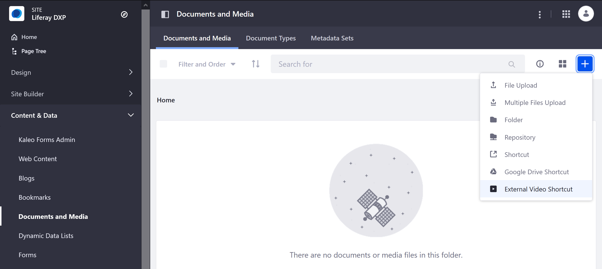
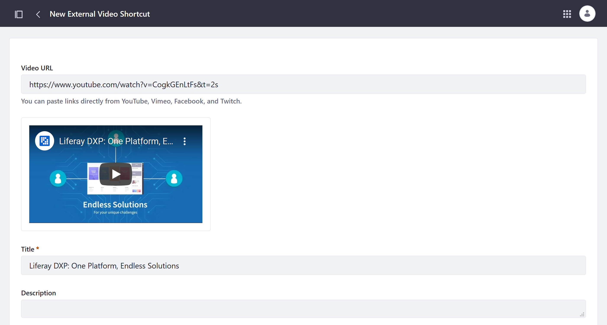
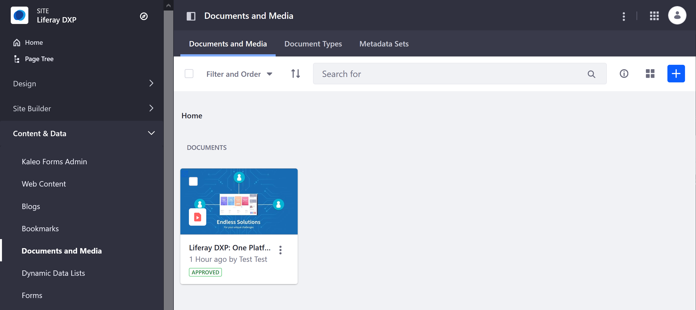

# Creating External Video Shortcuts

> Available for Liferay 7.4+

With Liferay's Documents and Media application, you can save references to videos hosted on external platforms. These references can then be used to [embed videos](./embedding-videos-into-liferay-assets-and-pages.md) into Liferay assets or Site Pages. YouTube, Facebook, Vimeo and Twitch are supported out of the box, but you can extend this feature to support custom video sources. <!--TASK: link to dev article once merged, "[support custom video sources](./creating-custom-video-shortcut-providers.md)"-->

Follow these steps to create an external video shortcut:

1. Navigate to the Documents and Media application in a Site or Asset Library.

   ```note::
      Shortcuts created in a Site are scoped to that Site, while shortcuts created in an Asset Library can be shared across multiple Sites. See `Asset Libraries Overview <>`_ for more information.
   ```

1. Click the *Add* button (), and select *External Video Shortcut*.

   

1. Enter a video URL from a supported platform: YouTube, Vimeo, Facebook, or Twitch.

   Videos from YouTube and Vimeo display a URL thumbnail, while Facebook and Twitch videos do not.

   

1. Enter a title for the shortcut.

   This field is auto-populated for YouTube and Vimeo, while Facebook and Twitch require manual input.

1. (Optional) Select a Display Page Template for the video.

   The selected template is used to display the video at a unique friendly URL and defines the display page's layout. See [Creating and Managing Display Page Templates](../../../site-building/displaying-content/using-display-page-templates/creating-and-managing-display-page-templates.md) for more information.

   

1. (Optional) Categorize the video shortcut using [tags and categories](../../tags-and-categories/organizing-content-with-categories-and-tags.md).

   

1. (Optional) Select related assets for the video shortcut.

   

1. (Optional) Configure permissions for the video shortcut.

   

1. Click on *Publish* when finished.

   You can view and manage external video shortcuts like any other Documents and Media asset:

   

Once created, External Video Shortcuts can be embedded inside most Liferay assets. See [Embedding Videos into Liferay Assets and Pages](./embedding-videos-into-liferay-assets-and-pages.md) for more information.

## Additional Information

* [Embedding Videos into Liferay Assets and Pages](./embedding-videos-into-liferay-assets-and-pages.md)
* [Creating Custom Video Shortcut Providers](./creating-custom-video-shortcut-providers.md)
