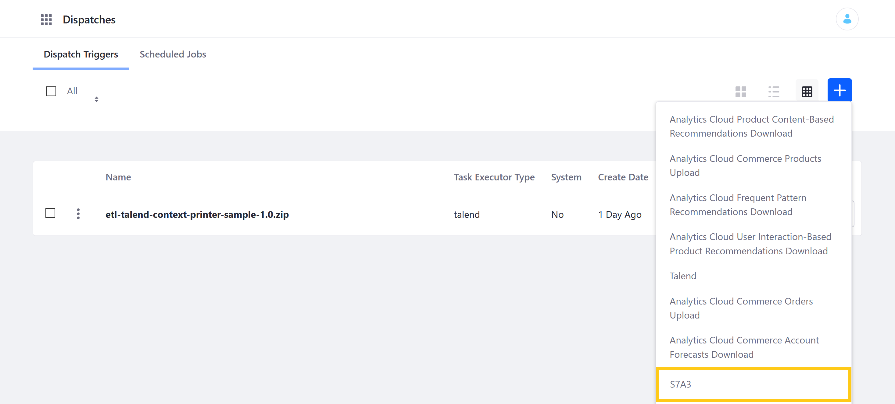
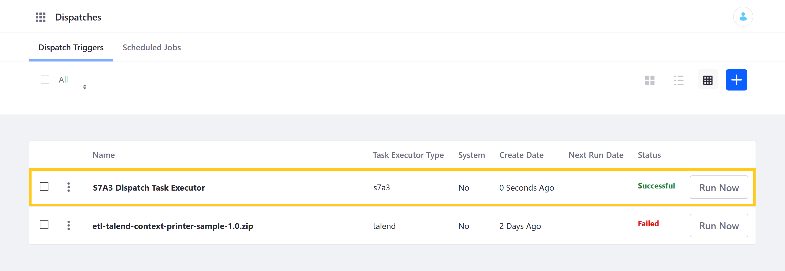
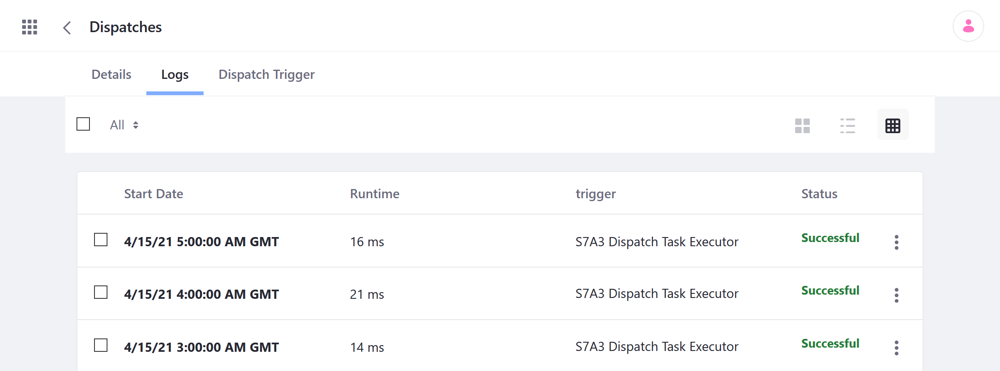

# Creating a New Dispatch Task Executor

Each Dispatch Task is created by implementing the `DispatchTaskExecutor` interface and can execute any logic. While Liferay DXP provides multiple out-of-the-box executors, you can create your own. Once created and deployed, you can add Dispatch Tasks to a Liferay instance.

Follow these steps to create your own implementation of the `DispatchTaskExecutor` interface:

1. **OSGI Component**: Declare the module a Component within the OSGi framework using the `@Component` annotation.

1. **Service**: Identify the module as a `DispatchTaskExecutor.class` service within the `@Component` annotation.

1. **OSGi Properties**: Add the following properties to the `@Component` annotation.

   * `dispatch.task.executor.name`: defines the string used for the executor's name in the Dispatch UI.

      ```note::
         If you want your Dispatch Task to use localized names, add a language key value for the ``dispatch.task.executor.name`` property to the module’s ``resources/content/Language.properties`` file.
      ```

   * `dispatch.task.executor.type`: defines a unique `type` value to match the right Dispatch Task Executor and Dispatch Trigger.

      ```note::
         Values must be unique to ensure the correct executor matches. If a value is not unique, the log displays an error on startup indicating which executors have the same property value.
      ```

1. [**`DispatchTaskExecutor`**](https://github.com/liferay/liferay-portal/blob/master/modules/apps/dispatch/dispatch-api/src/main/java/com/liferay/dispatch/executor/DispatchTaskExecutor.java): Implement the `DispatchTaskExecutor` interface or extend an implementation of it (e.g., ``BaseDispatchTaskExecutor``).

      ```important::
         Implementations of the `DispatchTaskExecutor` interface must handle status logs for Dispatch tasks, because the Dispatch framework depends on those logs to control the concurrent execution of tasks.
         
         For your convenience, Liferay provides the ``BaseDispatchTaskExecutor`` abstract `class <https://github.com/liferay/liferay-portal/blob/master/modules/apps/dispatch/dispatch-api/src/main/java/com/liferay/dispatch/executor/BaseDispatchTaskExecutor.java>`_ that logs the Dispatch task's status as ``IN PROGRESS``, ``SUCCESSFUL``, or ``FAILED``.
      ```

1. **Methods**: If you're implementing the `DispatchTaskExecutor` interface directly, override its `execute()` method to implement custom logic. If instead you're extending the ``BaseDispatchTaskExecutor`` abstract class, override its `doExecute()` method.

   ```note::
      The ``getName()`` method is deprecated and replaced by the ``dispatch.task.executor.name`` property.
   ```

   ```tip::
      You can use the ``dispatchTrigger.getDispatchTaskSettings()`` method to fetch properties set in the Dispatch Task's Settings editor.
   ```

The following sample module demonstrates how to create and deploy a custom Dispatch Task Executor to a Liferay instance.

## Deploying the Sample Dispatch Task Executor

Follow these steps to download, build, and deploy the sample Dispatch Task Executor to a new docker container:

1. Start a new [Liferay Docker container](../../installation-and-upgrades/installing-liferay/using-liferay-docker-images/docker-container-basics.md).

   ```bash
   docker run -it -p 8080:8080 [$LIFERAY_LEARN_DXP_DOCKER_IMAGE$]
   ```

1. Download and unzip the example module.

   ```bash
   curl https://learn.liferay.com/docs/dxp/latest/en/developing-applications/core-frameworks/dispatch-framework/liferay-s7a3.zip -O
   ```

   ```bash
   unzip liferay-s7a3.zip -d liferay-s7a3
   ```

1. Run this `gradlew` command to build the JAR file and deploy it to your new Docker container:

   ```bash
   ./gradlew deploy -Ddeploy.docker.container.id=$(docker ps -lq)
   ```

   The JAR is generated in the `build/libs` folder (i.e., `s7a3-impl/build/libs/com.acme.s7a3.impl-1.0.0`).

1. Confirm the module was successfully deployed and started via the container console.

   ```log
   Processing com.acme.s7a3.impl-1.0.0.jar
   STARTED com.acme.s7a3.impl-1.0.0 [1656]
   ```

1. Verify the module is working by using it to [add a new Dispatch Task](./using-dispatch.md#adding-a-new-dispatch-task) to your Liferay instance.

   

   Once you've created the task, click on *Run Now*.

   

   If successful, it should print the following message to the console when executed.

   ```log
   INFO [liferay/dispatch/executor-2][S7A3DispatchTaskExecutor:30] Invoke #doExecute(DispatchTrigger, DispatchTaskExecutorOutput)
   ```

   You can also click the Dispatch Task and go to the *Logs* tab to see a list of all previous runs.

   

## Code for the Sample Dispatch Task Executor

```literalinclude:: creating-a-new-dispatch-task-executor/resources/liferay-s7a3.zip/s7a3-impl/src/main/java/com/acme/s7a3/internal/dispatch/executor/S7A3DispatchTaskExecutor.java
   :language: java
   :lines: 15-44
```

The module is declared an OSGi `@Component` and defines two properties: `dispatch.task.executor.name` and `dispatch.task.executor.type`. It then identifies the module as a `DispatchTaskExecutor.class` service.

Following the `@Component` annotation, the module extends the `BaseDispatchTaskExecutor` abstract class and overrides the `doExecute` method. This method uses the `LogFactoryUtil` to display an INFO message in the console's logs.

## Additional Information

* [Understanding the Dispatch Framework](./understanding-the-dispatch-framework.md)
* [Using Dispatch](./using-dispatch.md)
* [Dispatch UI Reference](./dispatch-ui-reference.md)
