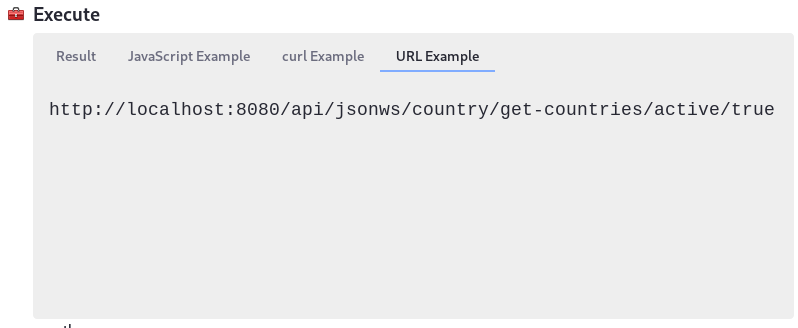

# Data Providers Overview

Data providers serve data that can be consumed by the Forms application. The REST Data Provider is included with the Forms application. With it, you can consume data from [REST web services](https://en.wikipedia.org/wiki/Representational_state_transfer) to autofill form fields.

* [Use the REST Data Provider to populate form options.](./using-the-rest-data-provider-to-populate-form-options.md)
* [Auto-populate form fields with a REST Data Provider and the Autofill rule.](../form-rules/using-the-autofill-rule.md)

One common example is using a REST Data Provider to populate a Select from List field's options with a list of countries.

## Registered JSON Web Services

Some data sources are from third party sources, such as the [restcountries.eu](https://restcountries.eu) data provider. Liferay DXP also has its own registered web services. If you are running a local server, see [http://localhost:8080/api/jsonws](http://localhost:8080/api/jsonws) for a list. If populating a list of countries, you'll find two `get-countries` JSON web services; either one works. Click _Invoke_ to generate the results.

```warning::
   To test using Liferay's web services with data providers in a local testing environment, you must enable local network access. See `Enabling Access to Data on the Local Network <./using-the-rest-data-provider-to-populate-form-options.md#enabling-access-to-data-on-the-local-network>`__.  
```

The _Result_ tab shows a list of countries using JSON syntax, like this record for Afghanistan:

```json
[
  {
    "a2": "AF",
    "a3": "AFG",
    "countryId": "20",
    "idd": "093",
    "mvccVersion": "0",
    "name": "afghanistan",
    "nameCurrentValue": "Afghanistan",
    "number": "4"
  },
    ...
```

Choose the selectable field from the web service. For `get-countries` it's most likely `nameCurrentValue`, because it contains the full, properly capitalized name of the country.

On the URL Example tab, find the URL to use when creating the data provider. It's the same as the one generated for accessing the `get-countries` JSON web service. Users can find the URL for any registered JSON web service using this same procedure.



## Data Provider Configuration Reference

You can configure data providers from the Forms application by going to _Site Administration_ &rarr; _Content & Data_ &rarr; _Forms_. Click the _Data Provider_ tab then the () icon to begin. There are several fields to fill out when configuring a data provider.


### URL

Enter the URL of an internal or external REST service endpoint. The example above shows the REST service at <https://restcountries.eu/> which contains an endpoint to find countries by `region`:

`https://restcountries.eu/rest/v2/region/{region}`

Data provider URLs can take two parameter types: path parameters and query parameters.

Path parameters are part of the URL calling the REST web service and are added using the pattern `https://service-url.com/service/{path_parameter_name}`:

For example, the `restcountries.eu` service's `region` endpoint's path parameter is `{region}`. Path parameters are mandatory parts of the URL, so make sure you specify an Input (see below) with a _Parameter_ field value matching the path parameter from the URL.

Query parameters are complementary parts of the URL that filter the output of the service call, following the pattern
`?query_parameter=query_parameter_value`:

    https://restcountries.eu/rest/v2/all?fields=capital

Unlike path parameters, query parameters are optional.

### User Name and Password

Enter the credentials used to authenticate to the REST Web Service, if necessary.

### Cache data on the first request

If the data is cached, a second load of the select list field is much faster, since a second call to the REST service provider is unnecessary.

### Timeout

Enter the time (in ms) to wait for a response to the REST call before aborting the request. 

### Inputs

Configure path or query parameters from the REST service to filter the REST service's response. Specify the Label, Parameter, and Type (Text or Number), and choose whether the input is required to use the data provider.

### Outputs

The Outputs are the Parameters to display in Select from List or Text fields with autocomplete enabled. You can add multiple Outputs. Outputs can be filtered by inputs (see above) but can also be displayed without configuring input filtering. Specify the Label, Path, and Type (Text, Number, or List).

You can add multiple Inputs. To provide a way to specify the input value, use an [Autofill Form Rule](../form-rules/using-the-autofill-rule.md). Users enter input into one field, and their input is sent to the REST service. The REST service's response data is filtered by the input parameter.

The Output Path field is specified in [JsonPath syntax](https://github.com/json-path/JsonPath), so it must always start with a `$`. The type of data returned by the Path must match the type you choose in the Type field. Using the `restcountries.eu` service, specify the `name` field as an Output by entering enter `$..name` in the Path field. If you have a more complex JsonPath expression to construct (for example, you need the names of all countries with a population over 100 million---`$..[?(@.population>100000000)].name` with the `restcountries.eu` service), consider using a `JsonPath` evaluator, like [this one](http://jsonpath.herokuapp.com/) or [this one](https://jsonpath.com/).

```tip::
   To display one value but persist another in the database, enter both into the Paths field, separated by a semicolon: ``$..name;$..numericCode``
```

If using the `restcountries.eu` data provider, the name of the country appears for the User, while the numeric country code is stored in the database.

## What's Next

* [Using the REST Data Provider to Populate Form Options](./using-the-rest-data-provider-to-populate-form-options.md)
* [Using the Autofill Rule](../form-rules/using-the-autofill-rule.md)
