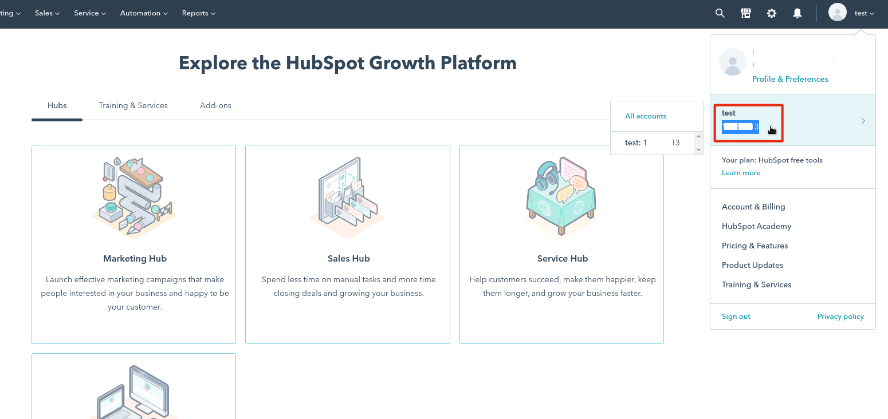
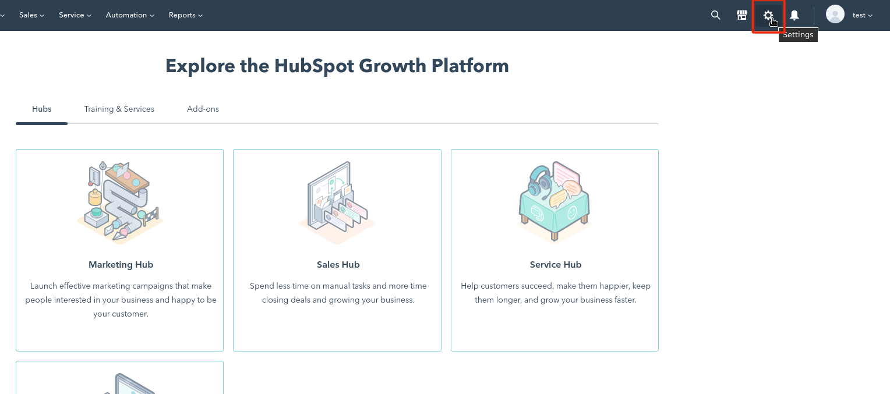
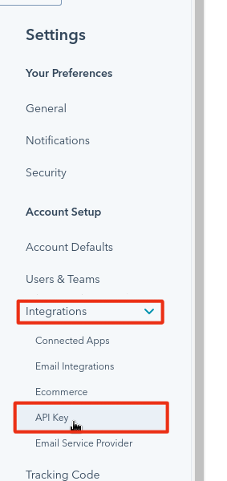
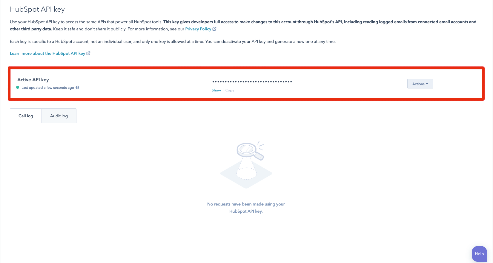
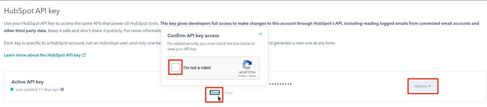

# Hubspot

[Hubspot](https://www.hubspot.com/) is a CRM platform that includes Live Chat functionality. Enabling integration with Hubspot requires two tokens: the Chat Provider Token and the Hubspot API Token.

## Locating the Chat Provider Token

1. Log in to your [Hubspot Account](https://app.hubspot.com/login).

1. Go to your profile in the top right corner.

    Copy the account number that corresponds to the channel you want to use. This number corresponds with the Account ID used when enabling Click to Chat on Liferay Portal.

    

## Getting the Hubspot API Token

While logged in to your Hubspot account:

1. Click the *Settings* button.

    

2. Click on *Integrations* &rarr; *API Key* on the left side of the page.

    

3. During your first acess you need to activate the API Key. Click *Actions* &rarr; *Generate*

    
   

    3.1 If you are not able to see your API Key, click *Show* to reveal it.

     

4. Your account ID is **ID Tolken/API Key**. 

    
   
5. Use this Account ID to [enable automated live chat integration](../enabling-automated-live-chat-systems.md) with your Liferay instance. 
