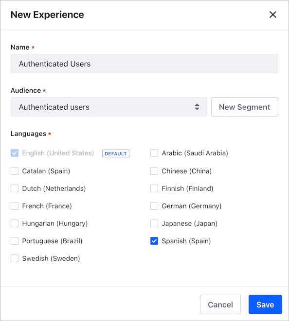

# Creating and Managing Experiences

> Some Experiences functionality is available in Liferay 7.4+, 7.3 Fix Pack 1+, and 7.2 Fix Pack 11+ only.

You can customize your Content Page to different groups of users using *Experiences*. To learn about Liferay DXP Experiences and understand how Experiences work, see [Content Page Personalization](./content-page-personalization.md).

## Creating a New Content Page Experience

1. Go to *Site Administration* &rarr; *Site Builder* &rarr; *Pages*.

2. On the Content Page you want to edit, click the *Actions* () menu and select *Edit*, or [create a new Content Page](../../creating-pages/building-and-managing-content-pages/building-content-pages.md).

3. At the top of the page, click on *Default* Experience to open the Experience selection dialog.

4. Click on *New Experience*.

    

5. Enter a name for the Experience and select the Segment for the audience you want to target, or [create a New Segment](../segmentation/creating-and-managing-user-segments.md).

    ```note::
       By default, new Experiences are assigned to the *Anyone* Segment and targeted to all website visitors.
    ```

1. On the *New Experience* dialog, under the Languages section, select [additional languages](./content-page-personalization.md#managing-experience-localization) you want to target with the Experience. For example, if your default Content Page language is en-US and you want to provide personalization for es-ES speakers, select this language as well. See [Managing Experience Localization](./content-page-personalization.md#managing-experience-localization) for more information.

    

6. Edit your Content Page with the information and layout you want to show to the selected Segment.

7. Using the Up () and Down () controls, move the Experience in the list to set its precedence (see [Understanding How Experiences Work](#understanding-how-experiences-work) for more information).

8. Click *Publish*.

After setting the Experience precedence, Members of the target Segment see the Page version customized for that Segment. All other users see the *Default* version.

## Managing Content Page Experiences

When you edit a Content Page, you can click on the *Experience* selector to manage the options for that page.


1. Go to *Site Administration* &rarr; *Site Builder* &rarr; *Pages*.

2. On the Content Page you want to edit, click the *Actions* () menu and select *Edit*.

3. Click on the Experience you want to manage. From here you can:

   - Set the Experience Priority, using the Up () and Down () controls.

   - Edit () the Experience's name, selected Segment or Language.

   - Duplicate () the Experience.

   - Delete () the Experience.

    ```important::
       The order of your Experiences in the Experience selector determines the Experience precedence. See the *Understanding How Experiences Work* section in the `Content Page Personalization topic <./content-page-personalization.md>`__ for more information.
    ```

## Related Information

- [Content Page Personalization](./content-page-personalization.md)
- [Personalizing Collections](./personalizing-collections.md)
- [Creating and Managing User Segments](../segmentation/creating-and-managing-user-segments.md)
