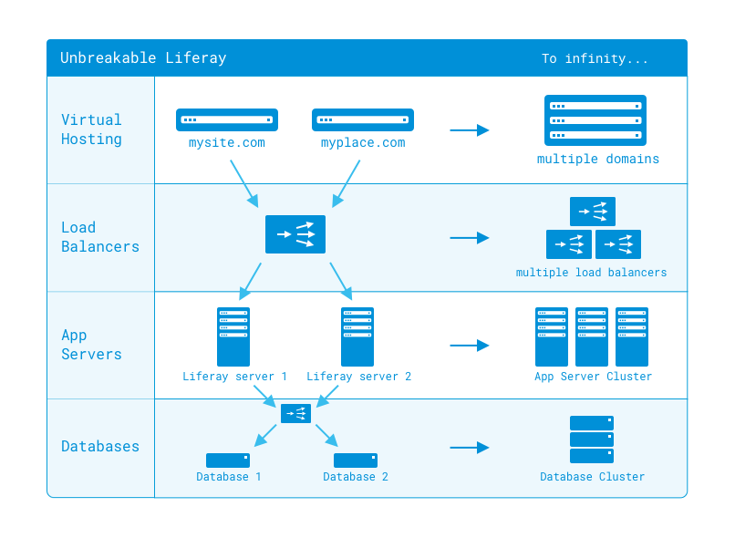

# Introduction to Clustering Liferay DXP

Liferay DXP can scale to serve everything from the smallest to the largest web sites. Out-of-the-box, it's configured optimally for a single server environment. If one server isn't sufficient to serve your site's high traffic needs, DXP scales to the size you need.

Liferay DXP works well in clusters of multiple machines (horizontal cluster) or in clusters of multiple VMs on a single machine (vertical cluster), or any combination. Once you have DXP installed on more than one application server node, there are several configurations that must be made. At minimum, DXP must be configured in the following way to function as a clustered environment:

1. [All nodes must point to the same database or database cluster.](./02-database-configuration-for-cluster-nodes.md)

2. [Documents and Media repositories must have the same configuration and be accessible to all nodes.](./03-documents-and-media-configuration-with-clustering.md)

3. [Search should be on a separate search server that is optionally clustered.](./04-clustering-search.md)

4. [Cluster Link must be enabled so the Liferay DXP cache replicates across all nodes of the cluster.](./05-cluster-link-overview.md)

5. [Applications must be deployed to each node individually.](#deploying-to-all-nodes)

Many of these configuration changes can be made by adding or modifying properties in your `portal-ext.properties` file. Remember that this file overrides the [defaults](https://docs.liferay.com/portal/7.2-latest/propertiesdoc/portal.properties.html) in the [`portal.properties`](../../14-reference/03-portal-properties.md) file. Best practice is to copy the relevant section you want to modify from `portal.properties` into your `portal-ext.properties` file, and then modify the values there.

> **Note:** This documentation describes a DXP-specific cluster configuration without getting into specific implementations of third party software, such as Java EE application servers, HTTP servers, and load balancers. Please consult the documentation for those components of your cluster to configure them. Before creating a DXP cluster, make sure your OS is not defining the hostname of your system to the local network at 127.0.0.1.

## Deploying to All Nodes

All modules and WAR files you deploy onto the cluster must be deployed to all cluster nodes. Because Liferay DXP [installs applications as OSGi bundles](https://help.liferay.com/hc/en-us/articles/360028710332-Deploying-WARs-WAB-Generator-), you cannot rely on your application server's means of installing WAR files to deploy an application to the entire cluster (even if you only intend to install WAR files). Instead, place the application in each node's auto deploy folder (e.g., `[Liferay Home]/deploy`).

Best practice is to accomplish this with a script. Write a shell script that uploads applications to each node using sftp or some other service. This way, when you deploy an application, it uploads to each node's auto deploy folder and installs to DXP on each node.
