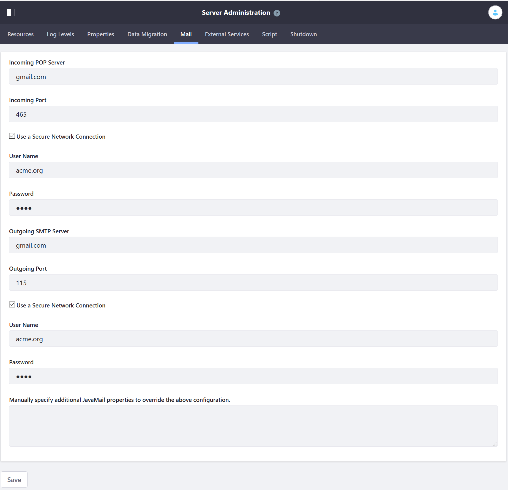

# Using Gmail for Email Notifications
<!-- Please rename the article itself, make the article super streamlined to focus on using Gmail for email notifications. Also please move this to where it should be in the docs repo.  -->
Liferay DXP can be configured to use a mail server to send email notifications for a variety of purposes: user registration and password management, site membership notifications, and content updates. This article will demonstrate how to configure DXP to use Gmail as its mail server.

**Warning**: If using the [IMAP](https://support.google.com/mail/answer/7126229?hl=en) protocol for a category’s mailing list, make sure to [configure the IMAP inbox to delete messages](https://support.google.com/mail/answer/78892?hl=en) as they are pulled by the email client that sends messages to the users on the mailing list. Otherwise, each email message retained on the server is sent to the mailing list each time there's a new post or update in the category.

## Configuring the Built-in Mail Session

Follow these steps to configure the mail session from the Control Panel:

1. Sign in as the administrative user (the user specified on the [Basic Configuration page](../installing-liferay-dxp-on-premises/running-liferay-dxp-for-the-first-time.md)).
1. Navigate to *Control Panel &rarr; Configuration &rarr; Server Administration &rarr; Mail*.
1. Enter your values for the following fields:

    * **Incoming POP Server:** (POP server hostname)
    * **Incoming Port:** (POP server port, such as, _465_)
    * **Use a Secure Network Connection:** Flagged.
    * **User Name:** joe.bloggs
    * **Password:** *****
    * **Outgoing SMTP Server:** (SMTP server hostname)
    * **Outgoing Port:** (SMTP server port, such as, _110_)
    * **Use a Secure Network Connection:** Flagged
    * **User Name:** joe.bloggs
    * **Password:** *****
    * **Manually specify additional JavaMail properties to override the above configuration:** If there are additional properties you need to specify, supply them here.

      

1. Click *Save*.

For more information, please see the [Mail Server Reference](./mail-server-configuration-reference.md).

DXP connects to the mail session immediately.

## Additional Information

* Advanced Mail Configuration Options
<!-- * [Configuring a Tomcat-Managed Mail Session](../01-installing-liferay-dxp/01-installing-liferay-on-an-application-server/01-installing-liferay-on-tomcat.md#mail-configuration) Move this reference to advanced article -->
* [Mail Server Configuration Reference](./mail-server-configuration-reference.md)
<!-- * [Configuring a WebSphere-Managed Mail Session](../01-installing-liferay-dxp/01-installing-liferay-on-an-application-server/05-installing-liferay-on-websphere.md#mail-configuration) Move this reference to advanced article -->
<!-- * [Apache Tomcat 9 JavaMail Sessions](https://tomcat.apache.org/tomcat-9.0-doc/jndi-resources-howto.html#JavaMail_Sessions) Move this reference to advanced article -->
