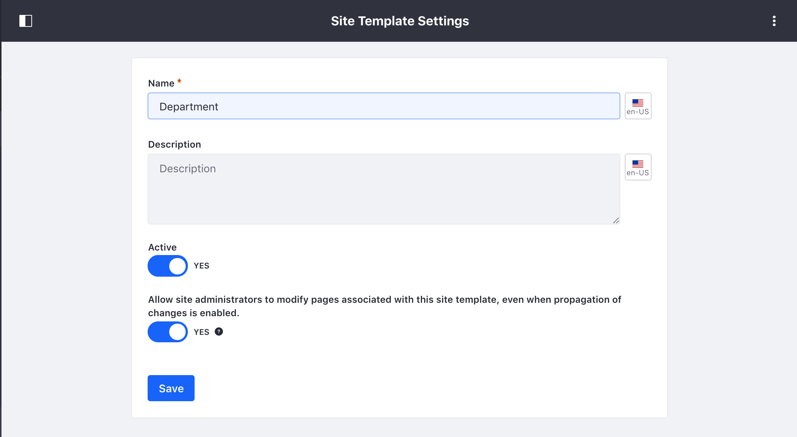
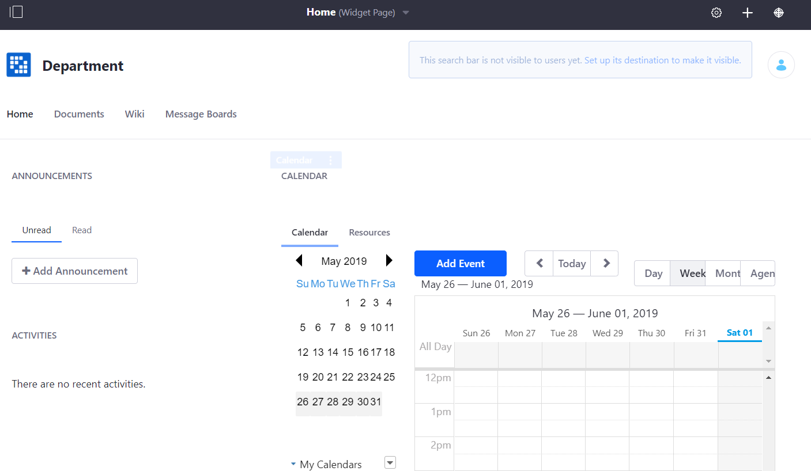

# Building Sites with Site Templates

Site Templates define a preconfigured structure for a Site, which includes the pages, theme, content, layouts, page templates, applications and app configurations defined for each page. You can use them to create multiple sites to keep the overall look and feel consistent between them, even if each Site that's created from a given Site Template ends up being very different. Any changes you make to a Site Template are automatically propagated to the sites that use it (unless specified otherwise).

By default, three Site Templates are provided out-of-the-box:

* **Blank Site:** Creates a Site that doesn't contain any pages or content.

* **Community Site:** Creates a preconfigured Site for building online communities. The Home page of a *community Site* provides message boards, search, a display of a poll and statistics of the activity of community members. The Site Template also contains a page for a wiki.

* **Intranet Site:** Creates a preconfigured Site for an intranet. The Home page displays the activities of the members of the Site, search, a language selector, and a list of the recent content created in the intranet. It also provides two additional pages for Documents and Media and external News obtained through public feeds.

Read the following topics to learn more about using, creating, or configuring Sites with Site Templates:

* [Creating a new Site from a Site Template](#creating-a-site-from-a-site-template)
* [Creating a Site Template](#creating-a-site-template)
* [Configuring a Site Template](#configuring-a-site-template)

## Creating a Site from a Site Template

To create a site using a Site Template, follow these steps:

1. Open the Product Menu and go to *Control Panel* &rarr; *Sites* &rarr; *Sites*.

  <!-- Screenshot -->

1. Click the *Add* icon () and select your Site Template from the menu.
1. Enter a name for the Site.
1. Check the *Create default pages as private (available only to members).*

    > **Note:** If unchecked, the Site Pages will be public (available to anyone).

1. Click *Save*.
1. Configure your [site settings](TODO).
1. Open the *Pages* panel below the form.
  
    <!-- Screenshot -->

    > **Note:** *Enable propagation of changes from the Site template* selector is enabled by default. This means that the Site receives updates if the Site Template is modified. If changes are made to a Site created from a Site Template, this link is broken and updates to the Site Template are **no longer propagated**. See [Merging Site Template Changes](./merging-site-template-changes.md) for more information.

1. Click *Save* to create your Site.
1. Open the Product Menu and go to *Sites* &rarr; *Sites* under the Control Panel.
1. Click *Actions* and select *Go to Public Pages* or *Go to Private Pages* next to your new Site to view it.

## Creating a Site Template

Follow these steps to create a new Site Template:

1. Open the Product Menu and go to the Control Panel and click *Sites* &rarr; *Site Templates*.

<!-- Screenshot -->

1. Click the *Add* icon () and enter a name for your template.

1. Leave the *Active* option enabled.

    > **Note:** The *Active* option must be enabled for your template to be usable. If your template is still a work in progress, toggle it to *NO* to ensure that no one uses it until it's ready. You can also categorize your Site Template using tags and categories by selecting the *Categorization* menu from the bottom of the page. To learn more about using tags and categories in Liferay Portal, see the [Organizing Content with Tags and Categories](TODO) section.

1. Optionally enable the *Allow Site administrators to modify pages associated with this Site template, even when propagation of changes is enabled* option.

    This gives Site Administrators permission to modify or remove the pages and apps that the template introduces to their Sites. Disable this if you want the templates to be completely static.

<!-- I read this step ^ several times and I still am not sure what it means. -->

1. Click *Save* to create your Site Template.

  > **Note:** If you need to modify this configuration later, select *Manage* from the Site Template's Actions Menu, and then select *Configuration* &rarr; *Site Template Settings* under site template's menu in the Product Menu.

## Configuring a Site Template

<!-- This feels less like "configuring" and more like "Specifying" or declaring what you want the Site Template to be. On first read through the act of "Creating" and "Configuring" both seem to me like the same thing, "Creating" a site template, since you basically HAVE to go through this section of "Configuring" if you want to have a working Site Template. -->

After you've created your Site Template, you must edit it to include the layouts, pages, apps, etc. that you want. Follow these steps:

1. Open the Product Menu and go to *Control Panel* &rarr; *Sites* &rarr; *Site Templates*.
1. Click the *Options* icon () next to the Site Template and select *Manage*.

    By default, the *Manage* interface opens *Site Builder* &rarr; *Pages* for the Site Template. You already have a home page.

    <!-- Screenshot -->

    The Site Template is active in the Product Menu. <!-- What does it mean for the Site Template to be active? --> Any assets created within your Site Template's Product Menu can only be accessed by Sites using the Site Template. <!-- Can an example be given? I THINK I know what this means, but I am not sure. -->

1. Add any pages you want for your Site Template. See the [Creating Pages](TODO) section for more information on creating pages.
1. Open the Product Menu and select *Go to Site* under the Site Template Menu to go to the pages you just created.
1. Configure each page with the layout, applications, app configurations, content, etc. that you want. The changes you make to your Site Template are automatically saved.

## Additional Information

As long as a Site is linked to the Site Template it was created from, changes to the Site Template's pages, apps, and app configurations are copied (propagated) to the Site. Changes to a Site Template's content, however, are not propagated to existing sites that are linked to the Site Template; this is also true for pages containing fragments (e.g., [Content Pages](TODO)).

> **Tip:** If you want to publish a piece of web content to many sites and ensure modifications are applied to all, don't use Site Template content for that purpose. Instead, place the content in the global scope and then reference it from a *Web Content Display* application in each site.

When a Site's Page Set is created from a Site Template and the propagation of changes from the Site Template is enabled (default), these rules apply to pages:

* Only users with the Site Template Administrator role can remove, reorder, or add Site Template pages.
* Site Template Administrators can't add, remove, or reorder custom site pages <!-- What is a 'custom site page' in this context? -->.
* Users with the Site Administrator role can add or remove custom site pages. They can also reorder custom site pages as long as they're all positioned after the Site Template pages.
* If a Site has both pages imported from a Site Template and custom Site pages, the Site Template pages appear first in the Site's page hierarchy. Custom pages added by Site Administrators appear after the Site Template pages.

<!-- Consider using a table that presents who can do what as a less 'wordy' way of presenting the above information -->

<!-- ## Related Topics
* Link to intro article
* Links to other site templates articles -->
