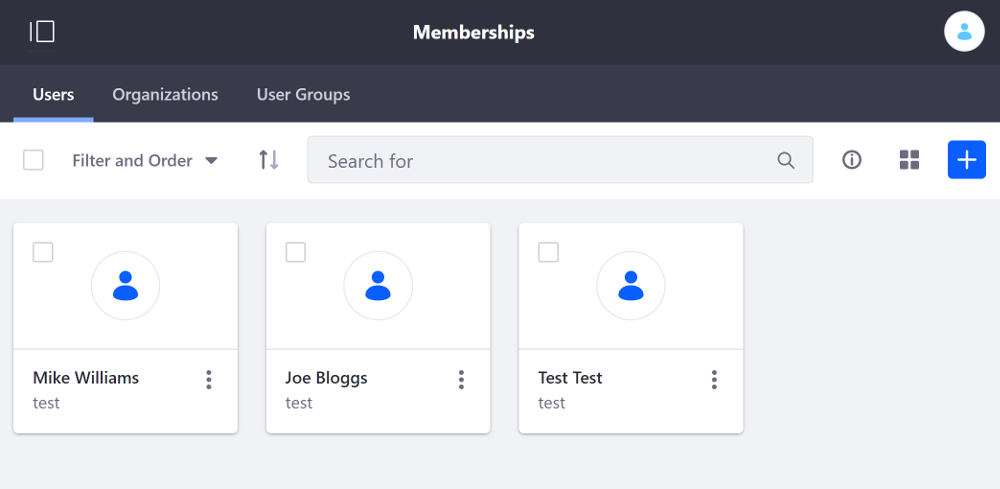
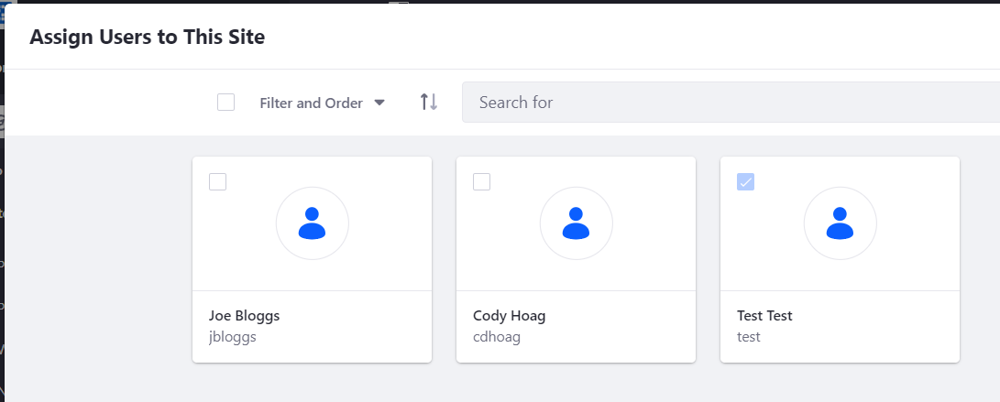
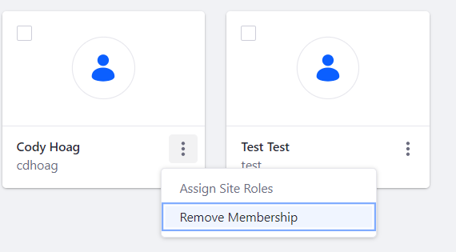
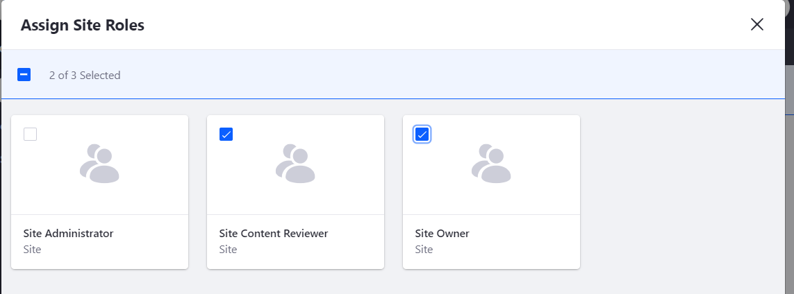

# Adding Members to Sites

Users and Sites are central concepts in Liferay DXP. Sites are where all your content and pages are stored, and Users access and create that content. While User management is covered in depth in [User Management](TODO), there are some configuration options specific to Site management and assigning Users to sites that are relevant here:

* [Managing Site Membership](#managing-site-membership)
* Configuring Users to Automatically Join a Site
* [Creating Teams](./creating-teams-for-sites.md) or groups of Site Members for various site functions

The steps below show how to add Users manually to Sites and how to provide options for self management.

## Managing Site Membership

Administrators can manage Site members from that Site's *Site Membership* page.

1. Open *Site Administration* and select the Site that you want to manage members for.

1. Click on *People* &rarr; *Memberships*

From here you can manage Site memberships, Organizations, and User Group associations. You can learn more about those in [Users and Organizations](TODO). On this page, you can see a list of all of the current Users of the Site and you can add or remove user memberships from the Site.

### Adding Members to a Site

Follow these steps to make an existing User a member of the Site:

1. Click the *New* () button in the top right of the screen.

1. Use *Filter and Order* or the *Search* function to locate the User you want to add to the Site.

1. Select the User(s) you want to add and click *Done*.

On the *Assign Users to This Site* screen, all users eligible to be added to the Site appear. Deactivated users do not appear. Site members also appear, but with a greyed-out checkbox.

### Removing User Membership from a Site

There are two ways to remove a User from a Site. To remove an individual member, follow these steps:

1. Click the *Actions* () icon for the User that you want to remove.

2. Select *Remove Membership*.

3. In the pop-up that appears, confirm the removal.

To bulk remove Users from a Site, follow these steps:

1. Click the checkbox for each User that you want to remove.

1. In the menu at the top of the page, click the `X` icon to remove the Users from the Site.

1. In the pop-up that appears, confirm the removal.

Removed Users lose access to the Site's Private Pages and membership in any Site Roles or Teams they had.

### Assigning Site Roles

Roles grant permissions in Liferay Portal. Roles can be assigned for the entire instance or just for one specific Site or Organization. Site Roles assign permissions for a specific Site. Learn more about roles in [Roles and Permissions](TODO).

Follow these steps to assign Site Roles to Users:

1. Select a User or Users and click *Assign Site Roles* (either through the Actions menu or the menu at the top). This take you to the *Assign Site Roles* screen.

1. Select the Roles that you want to assign to the selected User(s).

1. Click *Done*.

    

## Additional Information

<!-- This information should be moved to the "Understanding Site Membership" article since it answers the question "Why should I think twice about Site Membership" - which is a pretty important question, important enough to probably have at the top of another article, rather than the bottom fot his one. -->

Site membership provides these key benefits:

* Only Site members can view a Site's [Private Pages](TODO).
* Site members have more permissions than guests for many widgets like Message Boards and Wikis that enable them to create content and collaborate on your Site.
* Site members can be associated with Roles that grant Site privileges.

Site Roles are created at a global level, but when they're assigned they only provide permissions for the specific Site where they were assigned. Since Roles are created at a global level, they can't be created by Site Administrators (since Site Administrators only have Administrator privileges for their Site). *Teams*, however, let Site Administrators assign permissions to groups of Users within their Sites. See [Creating Teams](./creating-teams-for-sites.md) for more information.
